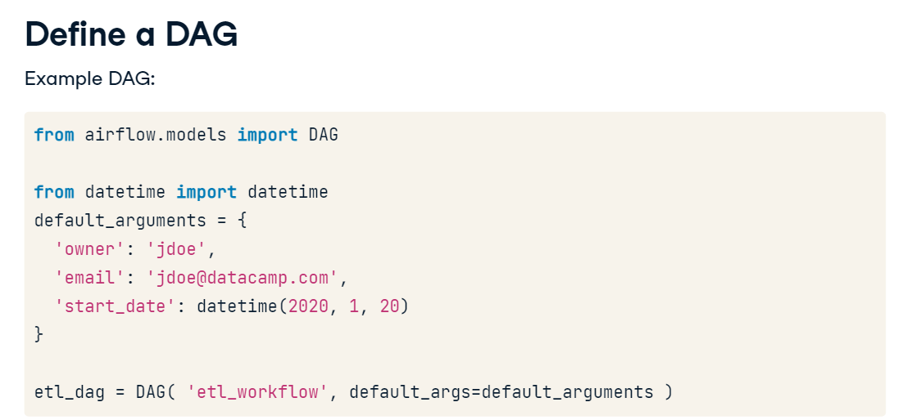
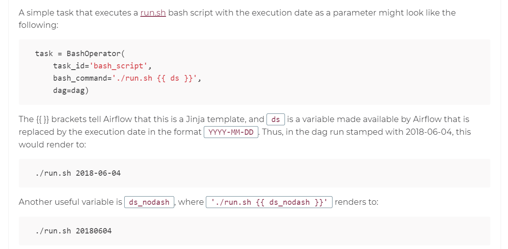

# Introduction to Airflow in Python

Airflow is not the only orchestrator tool, there are others like: Luigi, Bash Scripting, SSIS, etc.

Airflow has at least three components: Scheduler, Webserver, Metadata Database.

Redis is responsible for exchange tasks and messages between the workers.
..

### Simple DAG Definition

```
etl_dag = DAG(
  dag_id='airflow_etl',
  default_args={"start_date":"00-00-00 00:00"}
)

```

In order to run a task in a dag: `airflow run <dag_id> <task_id> <start_date>`

You can run `airflow -h` to see a list of possible commands.



In order to list dags `airflow list-dags`

Start Webserver on a different port: `airflow webserver -p 9000`

Airflow will try to backfill the missing data from the start-date in the script till the actual date, one thing to avoid this automatic backfill is to issue this command to mark the gap dates with a success
`airflow backfill MY_tutorial -m -s 2016-10-04 -e 2017-01-22T14:28:30`

Another way is to create a new DAG with a different name and set the start-date in a near future.

Or to run the backfill in backwards mode (first latest)

`airflow backfill -s <START_DATE> -e <END_DATE> --rerun_failed_tasks -B <DAG_NAME>`

# Operators

BashOperators

```

from airflow.operators.bash import BashOperator

BashOperator(
  task_id='bash_example',
  bash_command='echo ahah',
  dag=mydag
)

BashOperator(
  task_id='bash_example2',
  bash_command='run.sh',
  dag=mydag
)
```

After Airflow 1.8 you can use `>>` to upstream task and `<<` downstream task

task 1 runs first then task 2
`task1 >> task2`
or
`task2 << task1`


to run in parallel : `[task1, task2] >> task3`

Another Example:
`task1 >> task2 << task3`

## Python Operator

If you need to have a decision based on previous values to initiate any new task, you can use BranchPythonOperator (must have provide_context=True, it can accept **kwargs to get like kwargs['ds']) instead of PythonOperator. They are the same the differente is that BranchPythonOperator returns a dag to run.

```
from airflow.operators.python import BranchPythonOperator


def _check_task(ti):
  value_from_previous_dag=ti.xcom.pull(task_ids='one_task')
  if(value_from_previous_dag > 1):
    return [dummy2,send_message]
  return dummy1

def one_task():
  return 1

one_task = PythonOperator(
    task_id='one_task',
    python_callable=one_task,
    provide_context=True,
  )

check_task = BranchPythonOperator(              
    task_id='check_task',
    python_callable=_check_task,
    provide_context=True,
    do_xcom_push=False)

dummy1 = DummyOperator(task_id='dummy1')
dummy2 = DummyOperator(task_id='dummy2')
send_message = DummyOperator(task_id='send_message')

one_task >> check_task >> [dummy1,dummy2,send_message]

```

### **Python Operators support arguments**

Using `op_kwargs`, example:

```
def sleep(length_of_time):
  time.sleep(length_of_time)

sleep_task = PythonOperator(
  task_id='sleep',
  python_callable=sleep,
  op_kwargs={'length_of_time': 5},
  dag=example_dag
)

```

## Email Operator

```
from airflow.operators.email import EmailOperator

email_task = EmailOperator(
  task_id='email',
  to='blabla',
  subject='ahha',
  html_content='asdjhgas',
  files='asdasd.xls',
  dag=dag,
)
```

# Scheduling

- start_date: the date/ time to initially schedule the DAG tun
- end_date: Optional attribute for when to stop running new DAG instances
- max_tries: Optional attribute for how manyu attempts to make
- schedule_interval: How often to run

You can use `cron` or airflow presets like:

- @hourly
- @daily
- @weekly
- None - Dont schedule, just manual
- @once - Schedule only once

Special Note: The timer trigger is start_date + Schedule interval, like if you have start_date = 05.May.2020 and time_interval = @monthly, it'll be triggered 05.Jun.2020

# Sensors

An operator that waits for a specific condition to be true.

- Creation of a file
- Upload of a database record
- Certain response from a web request

## Sensor Details:

- Derived from airflow.sensors.base_sensor_operator
- Sensor arguments:
- `mode` - How to check for the condition
  - `mode=poke`- The default - run repeatedly
  - `mode=reschedule` - Give up task slow and try agian later
- `poke_interval` - How often to wait between checks
- `timeout` - How long to wait before failing task
- Also includes normal operator attributes

### File Sensor

- Is part of the `airflow.contrib.sensors` library
- Cehcks for the existence of a file at a certain location
- Can also check if any files exists within a directory

```
from airflow.contrib.sensors.file_sensor import FileSensor

file_sensor_task = FileSensor(task_id='file_sense',
file_path='salesdata.csv',
poke_interval=300,
dag=sales_report_dag)

init_sales_cleanup >> file_sensor_task >> generate_report
```

### Other Sensors

- `ExternalTaskSensor` - wait for a task in another DAG to complete
- `HttpSensor` - Request a web URL and check for content
- `SqlSensor` - Runs a SQL Query to check for content
- Many other sensors are available at airflow.sensors and airflow.contrib.sensors

**Why Sensors**

- Uncertain when it will be true
- If failure not immediately desired
- To add task repetition withour loops

# Airflow Executor

- Executor run tasks
- Different executors handle running the tasks differenctly

Example Executors:
- `SequentialExecutor`: Default Executor for Airflow, runs one task at a time, useful for debugging, not reccomended for production
- `LocalExecutor`: Runs on a single system, Treats tasks as processes, Pallelism defined by the user, Can utilize all resource of a given host
- `CeleryExecutor`: Uses Celery backend as task manager, Multiple worker systems can be defined, It signficantly more difficult to setup and configure, Extremely powerful method for organizations with extensive workflows

## Determine your executor

- via the `airflow.cfg` file
- Look for the `executor=` line

# Debugging and troubleshooting

- DAG won't run on schedule
  - Check if scheduler is running
  - schedule_interval hasn't passed
  - Not enough tasks free within the executor to run (Change executor type, Add system resources, add more systems, change DAG scheduling)
- DAG won't load
  - DAG not in web UI
  - DAG not in airflow list_dags (verify if it's in a correctr folder, Determine DAG folder in airflow.cfg)

- Sintax Error
  - The most common reason a DAG file won't appear
  - Sometimes difficult to find eror (two quicks methos: airflow list_dags or python <dagfile.py>)


# Defining SLA

SLA in Airflow is the amount of time a task or a DAG should require to run, an SLA Miss is any time the task/DAG does not meet the expected timing.

```
task1 = BashOperator(task_id='task1',
bash_command='echo aa',
sla=timedelta(seconds=30),
dag=dag)

#OR in the default_arguments

default_args={
  'sla': timedelta(minutes=20),
  'start_date': datetime(2020,2,20)
}
dag = DAG('sla_dag', default_args=default_args)

```

**General Reporting**: 

```
default_args={
  'email': ['aslkdjalk@jalskdad.com'],
  'email_on_failure': True,
  'email-on-retry': False,
  'email_on_sucess': True,
  ...
}
```

# Working with Templates

- Allow substituting information during DAGs run
- Provide added flexibility when defining tasks
- Are created using `Jinja` templating language

```
templated_command="""
  echo "Reading {{ params.filename }}"
"""

t1 = BashOperator(task_id='template_task',
                  bash_command=templated_command,
                  params={'filename':'file1.txt'},
                  dag=example_dag)

t2 = BashOperator(task_id='template_task',
                  bash_command=templated_command,
                  params={'filename':'file2.txt'},
                  dag=example_dag)

```

Another good thing is Jinja have Airflow builtin variables `ds` , `ds_nodash`, `prev_ds`, `prev_ds_nodash`, `dag`, etc... which let you get as param the actual, previous execution date , dag name, etc....

There is also **Macros** `{{macros}}`, `{{macros.timedelta}}`, `{{macros.ds_add('2020-04-15', 5)}}` this last one adds 5 days to a date



# Advanced Templates

```
templated_command="""

  echo "Reading {{ filename }}"

"""

t1 = BashOperator(task_id='template_task',
                  bash_command=templated_command,
                  params={'filenames': ['a.txt', 'b.txt']},
                  dag=example_dag)
```

# Airflow in Production

In order to run a specific task:

`airflow run <dag_id> <task_id> <date>`

To run a Full DAG

`airflow trigger_dag -e <date> <dag_id>`

