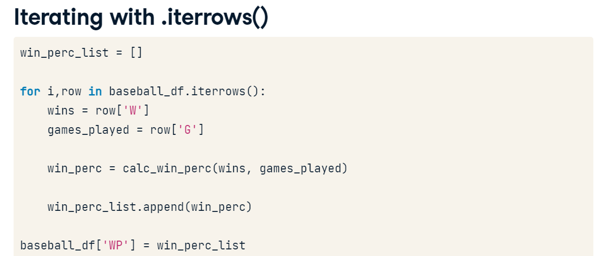
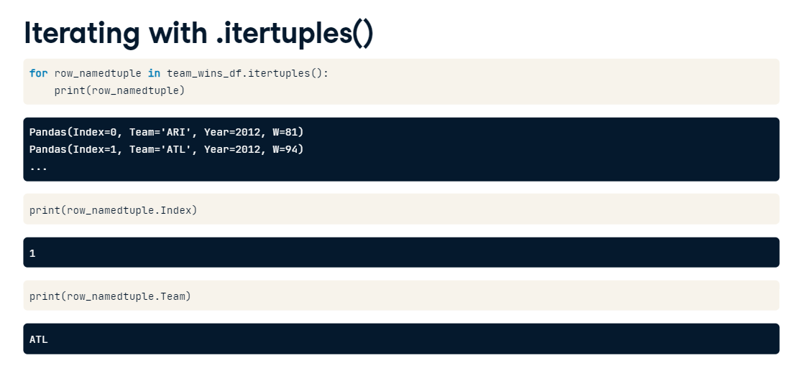
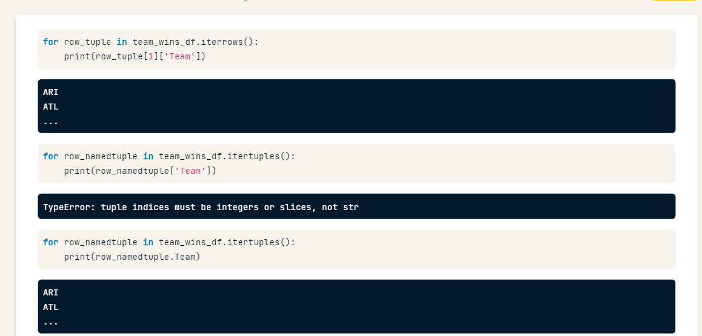

# Pandas Optimizations
 
 

 .itertuples() more efficient than .iterrows()

 Itertuples returns an special type called `namedtuple` that is part of the collections module.

 This data type behave similar to tuple, but have fields accesible using attribute lookup

 

 Accessing the elements correctly in iterrows and itertuples



There is a more efficient way: **APPLY**

```
run_diffs_apply = baseball_df.apply(lambda row: cal_run_diff(row['A'],row['B']), axis=1)
Base['RD'] = run_diffs_apply
# axis = 1 means we want to iterate over rows not columns that`d be 0
```

Pandas can vectorize the calculation (broadcasting) to avoid loops, like numpy.
In order to get a numpy array from a pandas column you can do like that:

```
test=df['column'].values
print(type(test))

<class = Numpy Array>
```
So, you can calculate values of a pandas df like:

```
run_diffs_np = baseball_df['RS'].values - baseball_df['RA']
baseball['RD'] = run_diffs_np
```
That Method is massive better than the other ones.