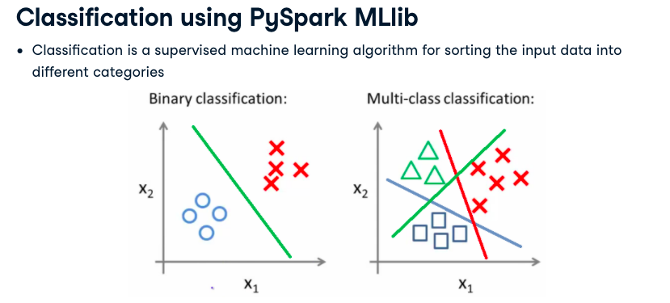

# Big Data Fundamentals with PySpark

- Volume
- Variety
- Velocity

- Clustered Computing: Collection of resources
- Parallel computing: Simultaneous computation
- Distributed Computing: Collection of nodes (networked computer) that run in parallel
- Batch Processing: Breaking the job into the small pieces and running them on individual machines
- Real-time processing: Immediate processing data.

**Hadoop/MapReduce: Scalable and fault tolerant framework written in Java**
- OpenSource
- Batch Processing
**Apache Spark: General purpose and lighting fast cluester computing system**
-Open source
-Both batch and real-time data processing.

## Features of Apache Spark Framework

- Distributed cluster computing framework
- Efficient in-memory computations for large data sets.
- Lightning fast data processing
- Provides support for Java, Scala, Python, R and SQL

Apache Spark Components:
- Spark SQL: Process structure and semi-structured
- Mlib: Machine larning algos.
- GraphX: Collection algo and tools for manipulates graphs
- Spark Streaming: Process RealTime data

## Spark modes of deployment

- Local mode: Single machine such as your desktop
    - Local mode convenient for testing, debugging and demonstration
- Cluster mode: Set of pre-defined machines
    - Good for production
- Workflow: Local -> clusters
- No code change necessary

## PySpark: Spark with Python

- Apache spark is written in Scala
- To support Python with Spark, Apache Spark Community released PySpark
- Similar computation speed and power as Scala
- PySpark APIs are similar to Pandas and Scikit-Learn

Spark Shell is an interactive environment, helpful for fast interactive prototyping and allow interacting with data on disk or in memory. 
Three different Spark Shells for each Language:
- Spark-shell for Scala
- PySpark-shell for Python
- SparkR for R

### PySpark shell
- PySpark shell is the Python-based command line tool
- PySpark shell alows data scientes interface with Spark data structures
- PySpark shell support connecting to a cluster.

## SparkContext

- SparkContext is an entry point into the world of Spark
- An entry point is a way of connecting to Spark Cluster
- An entry point is like a key to the house
- PySpark has a default SparkContext called `sc`

Inspecting SparkContext:

`sc.version` retrieves SparkContext version

`sc.pythonVer` retrieves Python version of SparkContext

`sc.master` URL of the cluster or local string to run in local mode of SparkContext

## Loading data in PySpark

- SparkContext\`s `parallelize()` method
`rdd = sc.parallelize([1,2,3,4,5])`

- SparkContext's `textFile()` method

`rdd2 = sc.textFile("test.txt")`


## Review of functional programming in Python

### Lambda functions

anonymous functions, quite efficient with map and filter.

sintax: `lambda arguments: expression`

```
double = lambda x: x * 2
print(double(3))
```

### Map

`map(function, list)`

`list(map(lambda x: x + 2, items))`

## Filter

`filter(function, list)`
`list(filter(lambda x: (x%2 != 0), items))`

## RDD

RDD = Resilient Distributed Datasets

Data File on Disk -> Spark Driver creates RDD and distributes amount Nodes

- Resilient: Ability to withstand failures
- Distributed: Spanning across multiple machines
- Datasets: Collection of partitioned data e.g, Arrays, Tables, Tuples, etc...

### Creating of creating RDDs

- parallelizing an existing collection of objects

`numRDD = sc.parallelize([1,2,3,4]`

`helloRDD = sc.parallelize("Hello World")`

`type(helloWorld)`

- External datasets:
    - Files in HDFS
    - Objects in Amazon S3 bucket
    - lines in a text file

`fileRDD = sc.textFile("README.me")`

`type(fileRDD)`
- from existing RDDs

## Partitioning in PySpark

A partition is a logical division of a large distributed data set.

By Default Spark distribute the partition based on available resources, external datasets, etc.. however it can be controlled by passing a second arg called minPartitions, which defines the minimum number of partitions to be created for an RDD.

```
numRDD = sc.parallelize(range(10), minPartitions=6)

# The number of partitions can be found using getNumPartitions()
```

## Overview of PySpark Operations

Spark Operations: Transformations + Actions

- Transformation create new RDDs
- Action perform computation on the RDDs

### Lazy Evaluation

Transformations follow Lazy Evaluation, the graph starts only when an action is performed on a RDD.
Example of RDD transformations: `map()`, `filter()`, `flatMap()`, `union()`

- `map` applies a function to all elements in a RDD.
```
RDD = sc.parallelize(range(1,10), minPartitions=4)
RDD_square = RDD.map(lambda x: x * x)
```

- `filter` filter elements that pass a condition.

```
RDD = sc.parallelize(range(1, 10))
RDD_filtered = RDD.filter(lambda x: x < 10)

```

- `flatMap` returns multiple values for each element in the original RDD

RDD = sc.parallelize(["Hello World", "how are you"])
RDD_flatmap = RDD.flatMap(lambda x: x.split(" "))

- `union` join two RDDs

```
inputRDD = sc.textFile("logs.txt")
erroRDD = inputRDD.filter(lambda x: "error" in x.split())
warningsRDD = inputRDD.filter(lambda x: "warnings" in x.split())
combinedRDD = errorRDD.union(warningsRDD)
```

## RDD Actions

Operation return a value after running a computation on the RDD
Basic RDD Actions:

- collect() -> return all the elements of the dataset as an array, e.g. `RDD_map.collect()`
- take(N) -> returns an array with the first N elements of the dataset, e.g. `RDD_map.take(2)`
- first() -> prints the first element of the RDD, similar to take(1)
- count() -> returns the number of elements in the RDD


## Pair RDDs in PySpark

Real life datasets are usually key/value pairs.
Each row is a key and maps to one or more values
Pair RDD is a special data structure to work with this kind of datasets. Pair RDD: Key is the identifier and value is data.

- Two common  ways to create pair RDDs
    - From a list of key-value tuple
    - From a regular RDD
- Get data into key/value form for a paired RDD

```
my_tuple = [('Sam', 23), ('Mary', 34), ('Peter',25)]
pairRDD_tuple = sc.parallelize(my_tuple)

#OR

my_list = ['Sam 23', 'Mary 34', 'Peter 25']
regularRDD = sc.parallelize(my_list)
pairRDD_RDD = regularRDD.map(lambda s: (s.split(' ')[0], s.split(' ')[1]))
```

- All regular transformations work on pair RDD.
- Have to pass functions that operate on key value pairs rathen than on individual eleements
- Examples of paired RDD Transformations
- reduceByKey(func): Combine values with the same key
- groupByKey(): Group values with the same key
- sortByKey(): Return an RDD sorted by the key
- join(): Join two pair RDD based on their key

- reduceByKey() -> Transformation combines values with the same key.
    - it runs parallele operations for each key in the dataset
    - it is a trasnformation not action

```
regularRDD = sc.parallelize([("Messi", 23), ("Ronaldo", 34), ("Neymar, 22"), ("Messi", 24)])
pairRDD_reducedbykey = regularRDD.reduceByKey(lambda x,y : x + y)
pairRDD_reducebykey.collect()
/> [('Neymar', 22), ('Ronaldo', 34), ('Messe', 47)]
```

- sortByKey() operation order pair RDD by key
    - it returns an RDD sorted by key in asc or desc.

```
oairRDD_reducebykey_rev = pairRDD_reducebykey.map(lambda x: (x[1], x[0]))
pairRDD_reducedbykey_rev.sortByKey(ascending=False).collect()
```

- groupByKey() groups all the values with the same key in the pair RDD

```
airports = [("US", "JFK"),("UK", "LHR"),("FR", "CDG"),("US", "SFO")]
regularRDD = sc.parallelize(airports)
pairRDD_group = regularRDD.groupByKey().collect()
for cont, air in pairRDD_group
    print(cont, list(air))
/>
FR ['CDG']
US ['JFK', 'SFO']
UK ['LHR']
```

- `join()` transformation joins the two pair RDDs based on their key

```
RDD1 = sc.parallelize([("Messi", 34), ("Ronaldo", 32), ("Neymar", 24)])
RDD2 = sc.parallelize([("Messi", 100), ("Ronaldo", 80), ("Neymar", 120)])

RDD1.join(RDD2).collect()
/> [('Neymar', (24,120)), ('Ronaldo',(32,80)), ('Messi',(34,100))]
```

## More Actions on RDD - Advanced

- `reduce(func)` actions is used for aggregating the elements of a regular RDD
- the function should be commutative (changing the order of the operands does not change the result) and associative, like +
- An example of reduce() action in PySpark

```
x = [1,3,4,6]
RDD = sc.parallelize(x)
RDD.reduce(lambda x, y : x + y)
/> 14
```

- `saveAsTextFile()`: actions saves RDD into a text file inside a directory with each partition a separate file

*In many cases, it is not advisable to run collect action on RDDs because of the huge size the data, in this cases are recommended to save the data to HDFS like amazon S3*

Save RDD into a text file inside a directory with each partition a separate file

`RDD.saveAsTextFile("tempFile")`

`coalesce()` method can be use to save RDD as single text file

`RDD.coalesce(1).saveAsTextFile("tempFile")`

## Action Operations on pair RDDs

- RDD actions available for PySpark pair RDDs
- Pair RDD actions leverage the key-value data
- Few examples of pair RDD actions include
    - `countByKey()`
        - only available for type (K, V)
        - action counts the number of elements for each key
        - Example  (use if it fits in memory)
        ```
        rdd = sc.parallelize([("a",1),("b",1),("a",1)])
        for kee, val in rdd.countByKey().items():
            print(kee, val)
        /> ('a', 2)
            ('b', 1)
        ```
    - `collectAsMap()`
        - retyrn the key-value pairs in the RDD as a dict
        - Example:
        ```
        sc.parallelize([(1,2), (3,4)]).collectAsMap()
        /> {1 :2, 3: 4}

        #Resulting data is expect to be small as all data is loaded into the memory
        ```

## PySpark SQL

It is a Spark library for structured data.

- PySpark DataFrame is an immutable distributed collection of data with named columns
- Designed for processing both structured (eg rdbms) and semi-structured data (eg JSON)
- Dataframe API is available in Python, R, Scala and Java
- Dataframes in PySpark support both SQL queries or expression methods

Similarly to SparkContext is the entrypoint for creating RDDs, SparkSession provides a single point of entry to interact with Spark DataFrames
 
 ### Creating DataFrames in PySpark

 There are two ways:

 - From existing RDDs using SparkSessions's createDataFrame() method
 - From various data sources(CSV, JSON, TXT) using SparkSessions read method
 - Schema controls the data and helps DataFrames to optimize queries
 - Schemas provides information about the column name, type of data in the clumn, empty value, etc...

 

 ```
 df_csv = spark.read.csv("people.csv", header=True, inferSchema=True)
 ```

 ## DataFrame Operations

 DataFrame Operations

 - Transformations: `select()`, `filter()`, `groupby()`, `orderby()`, `dropDuplicates()`, `withColumnRenamed()`
 - Actions: `printSchema()`, `head()`, `show()`, `count()`, `columns`, `describe()`


 **select() and show()**

 ```
 df_id_age = test.select('Age')
 df_id_age.show(3)
 ```

 **filter() and show()**

 ```
 
 new_df_age21 = new_df.filter(new_df.Age > 21)
 new_df_age.show(3)
 ```

 **groupby() and count()**
```
 test_df_age_group = test_df.groupby('Age')

test_df_age_group.count().show(3)
```

**orderby()**

```
test_df_age_group.count().orderBy('Age').show(3)
```

**dropDuplicates()**

```
test_df_no_dup = test_df.select('User_ID','Gender', 'Age').dropDuplicates()
test_df_no_dup.count()
```

**withColumnRenamed**

```
test_df_sex = test_df.withColumnRenamed('Gender', 'Sex')
test_df_sex.show(3)
```

**printSchema()**

```
test_df.printSchema()
/> USER_ID: integer (nullabl = true)
```

**columns operator prints the columns od a DF**

`test_df.columns`

**describe() operation compute statistics over columns**

`test_df.describe().show()`

## PySpark SQL

- The SparkSession `sql()` method executes SQL query
- `df.createOrReplaceTempoView("table1")`

```
df2 = spark.sql("SELECT field1, field2 FROM table1")
df2.collect()
```

## Data Visualization with PySpark

There is no way to direct create charts from PySpark Dataframes. 
But you can use these three methods instead:

- pyspark_dist_explore library
 there are hist(), distplot() and pandas_histogram
```
hist(test_df_age, bins=20, color="red")
```
- toPandas()
```
df_pandas = test_df.toPandas()
```
**Attention Point**: Pandas Dataframes are in-memory, single-server based structures and operations on PySpark run in parallel. Also pandas df are mutable and pyspark df are not. Pandas API support more operations than pyspark api
- HandySpark library, is a package designed to improve PySpark user experience
```
hdf = test_df.toHandy()
hdf.cols["Age"].hist()
```

# PySpark MLib

make pratical machine learning scalable and easy, MLib is a component of apache spark for ML. It only supports RDD not DataFrames nor DataSets

- ML Algorithms: collaborative filterting, classification and clustering
- Featurization: feature extraction, transformation, dimensionality reduction and selection
- Pipelines: tools for construction, evaluating and tuning ML Pipelines

## Sci-kit learn vs Spark MLib

Scikit-learn works well for small to mid datasets on a single machine, but not for large datasets that require the power of parallel processing.

Spark MLib algorithms are designed for parallel processing on a cluster. It supports languaes such as Scala, Java and R and provides a high-level API to build machine learning pipelines


The three C's of ML in PySpark MLib

- Collaborative filtering (recommender engines): Produce recommendations
- Classification: Identifying to which of a set of categories a new observation
- Clustering: Groups data based on similar characteristics

## PySpark MLib imports


```
#pyspark.mllib.recommendation
from pyspark.millib.recommendation as ALS

#pyspark.mllib.classification
from pyspark.millib.classification import LogisticRegressionWithLBFGS

#pyspark.mllib.clustering
from pyspark.mllib.clustering import KMeans

```

## Collaborative Filtering

- Finding users that share common interests
- Commonly used for recommender systems

Two Approaches:

- User-User Collaborative Filtering: Finds users that are similar to the target user
- Item-Item Collaborative filtering: Finds and recoomends items that are similar to items with the target user

Rating Class: its is a wrapper around tuple (user, product and rating)
Useful for parsing the RDD and creating a tuple of user, product and rating

```
from pyspark.millib.recommendation import Rating
r = Rating(user=1, product=2, rating=5.0)
(r[0], r[1], r[2])

/> (1,2,5.0)
```

## Splitting the data using randomSplit()

```
data = sc.parallelize(range(1,10))
training, test = data.randomSplit([0.6, 0.4])
training.collect()
test.collect()
```

## Alternating Least Squares


## Model Evaluation using MSE


## Classification

Sorting ML algorith in different categories.




## Clustering

Unsupervised Learning task to organize groups of data

- K-means
- Gausiann mixture
- Power iteration clustering (PIC)
- Bisecting k-means
- Streaming k-means


