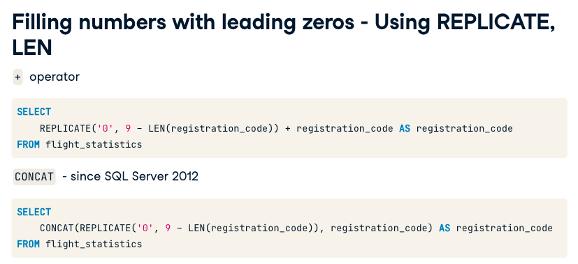
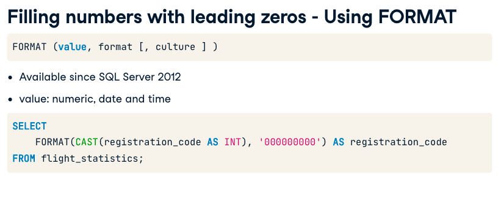
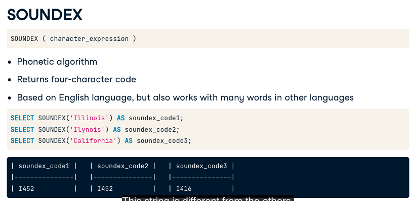
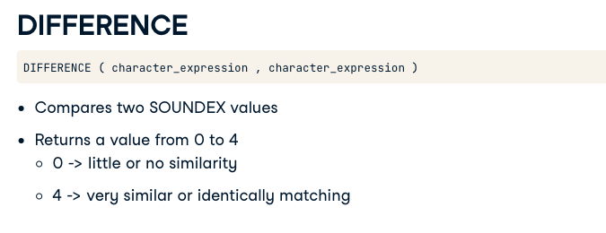
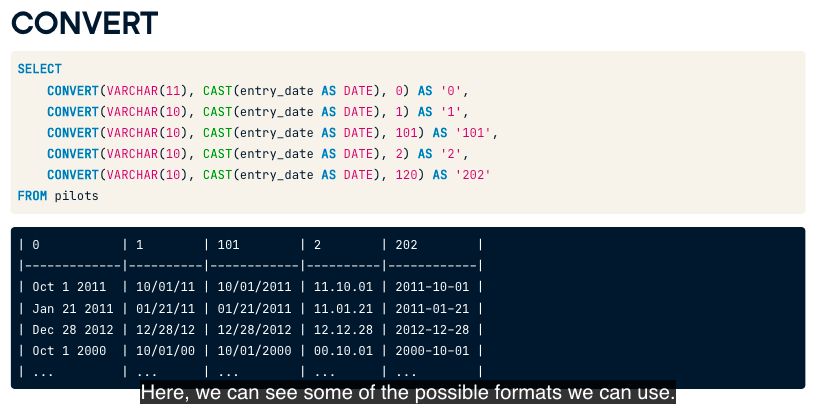
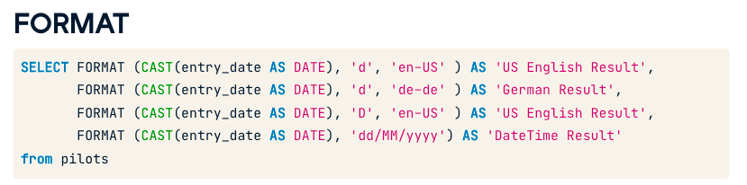
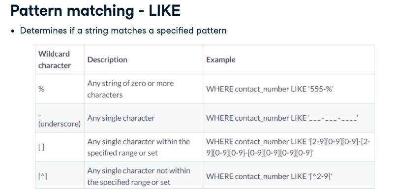
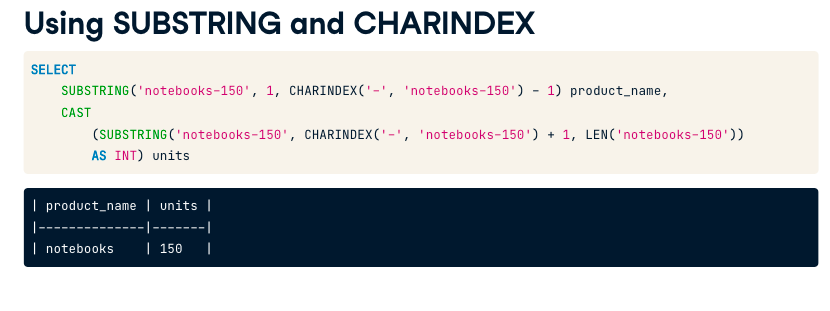

# Cleaning data in SQL Server

### Filling some information to string field, like '000000' we can use replicate or format

### Remove blank spaces between the end and the start of the String, use `TRIM` for SQL 2017+ and `LTRIM` and `RTRIM` for SQL SERVER 2016-

### Replace Strings use: `REPLACE(column, ocurrence, string-replace)`

### `UPPER` converts a string to uppercase

## Comparing Similarities between Strings

SQL Server has the functions `SOUNDEX` and `DIFFERENCE`

- SOUNDEX: Can check the string based on its pronounciation. (based on English language)

Although Soundex is not 100% perfect, it can help.

- DIFFERENCE:

### ISNULL

`ISNULL(column, "Unknown")`
`ISNULL(column, SELECT AVG(column) FROM table)`

### COALESCE

`COALESCE(field1, field2, 'unknown')`

## Dealing with Date Formats

- CONVERT

- FORMAT (perfomance is worst than CONVERT)  

## Converting data type

Use `CONVERT` or `CAST`

## Pattern Match

### Concat two string fields

If you have SQL 2012+
CONCAT(field1,' ',field2) 
**it ignores NULL values**

SQL2012- use the `+` operator.
**use ISNULL function to avoid NULL concats**

### Combine dates

`DATEFROMPARTS` function for SQL2012+
`DATEFROMPARTS(year, month,day) AS complete_date`

## Substring and CharIndex

## LEFT, RIGHT and REVERSE.

LEFT(field, num)
RIGHT(field,num)
REVERSE(field)

## PIVOT TABLES

