# Spark SQL

```
df = spark.read.csv('test.csv', header=True)
df.createOrReplaceTempView('schedule')
spark.sql(""SELECT * FROM schedule WHERE station='San Jose').show()
result = spark.sql("SHOW COLUMNS FROM tablename")
result = spark.sql("SELECT * FROM tablename LIMIT 0")
result = spark.sql("DESCRIBE tablename")
result.show()
print(result.columns)
```

## Window Function

```
query = """
SELECT train_id, station, time, 
LEAD(time,1) OVER (ORDER BY time) AS time_next
FROM sched
WHERE train_id=324"

# OR

query = """
SELECT train_id, station, time, 
LEAD(time,1) OVER (PARTITION BY train_id ORDER BY time) AS time_next
FROM sched
WHERE train_id=324"

```

## Dot notation and SQL

- `df.select('colA', 'colB')`
- `df.select(df.colA, df.colB)`
- `from pyspark.sql.functions import col`
    - `df.select(col('colA'), col('colB'))`

We can rename a column like these two forms:

- `df.select('train_id').withColumnRenamed('train_id', 'train')`
- `df.select(col('train_id').alias('train'))`

In SparkSQL we can use `AS` to rename columns.


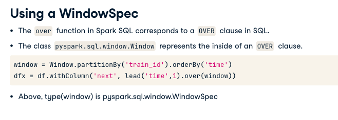

```
# Obtain the identical result using dot notation 
dot_df = df.withColumn('time_next', lead('time', 1)
        .over(Window.partitionBy('train_id')
        .orderBy('time')))
```

```
# Create a SQL query to obtain an identical result to dot_df
query = """
SELECT *, 
(UNIX_TIMESTAMP(LEAD(time, 1) OVER (PARTITION BY train_id ORDER BY time),'H:m') 
 - UNIX_TIMESTAMP(time, 'H:m'))/60 AS diff_min 
FROM schedule 
"""
sql_df = spark.sql(query)
sql_df.show()
```

## Window Function for Natural Language Processing

```
df = spark.read.text('sometxt.txt')

print(df.first())
print(df.count())

df = spark.read.load('sherlock.parquet')

# Lower

df = df1.select(lower(col('value')))

# Regex

df = df1.select(regexp_replace('value', 'Mr\.', 'Mr').alias('v'))

# Split

df = df1.select(split('v', '[ ]'))

# Split removing unwanted punctuation
punctuation = "_|.\?\!\",\'\[\]\*()"
df = df1.select(split('v', '[ %s]' % punctuation))

#Explode create a row for each array element

df = df1.select(explode('word').alias('word'))

#Bringing only non-blank rows

df_n_blank = df1.where(length('word') > 0)
```

## Common word sequences

3 Tuples: Select groupby 3 sequences words and count it.
like:

| w1 | w2 | w3 | Count |
|---|---|---|---|
| I | Think | that | 40 |
| I  | guess | that | 20 |
| One | of | the | 15 |

```
subquery = """
SELECT chapter, w1, w2, w3, COUNT(*) as count
FROM
(
    SELECT
    chapter,
    word AS w1,
    LEAD(word, 1) OVER(PARTITION BY chapter ORDER BY id ) AS w2,
    LEAD(word, 2) OVER(PARTITION BY chapter ORDER BY id ) AS w3
    FROM text
)
GROUP BY chapter, w1, w2, w3
ORDER BY chapter, count DESC
"""
```
```
#   Most frequent 3-tuple per chapter
query = """
SELECT chapter, w1, w2, w3, count FROM
(
  SELECT
  chapter,
  ROW_NUMBER() OVER (PARTITION BY chapter ORDER BY count DESC) AS row,
  w1, w2, w3, count
  FROM ( %s )
)
WHERE row = 1
ORDER BY chapter ASC
""" % subquery

spark.sql(query).show()
```

## SparkSQL Cache

- `df.cache()`
- `df.unpersist()`
- `df.is_cached`

`df.storageLevel` gives five details about cache: `useDisk`, `useMemory`, `useOffHeap`, `deserialized` and `replication`

- useDisk: default True, whether to move some or all df to disk if needed to free up memory
- useMemory: default True, whether to keep data in memory
- useOffHeap: default False, The on-heap refers to objects in a in-memory data structure that is fast to access
- deserialized: default True, it`s faster but uses more memory, serialized data is more space-efficient but slower to read. (Disk cache is always serialized, so this option applies only to memory)
- replication: default 1, it tell to Spark to replicate data across multiple nodes, fast fault recovery when a node fails.

`df.persist()` is equivalent to `df.cache()` the only difference persist accept storagelevel argument, like: `df.persist(storageLevel = pyspark.StorageLevel.MEMORY_AND_DISK)`

In order to cache a table, use `Spark.catalog.cacheTable('table')`

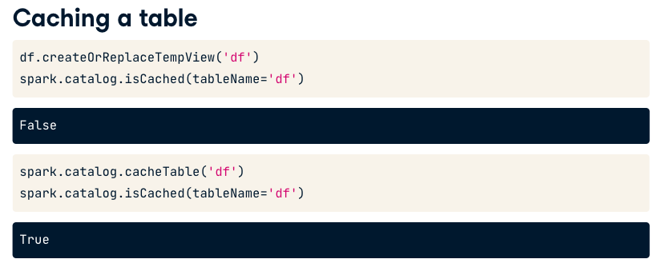


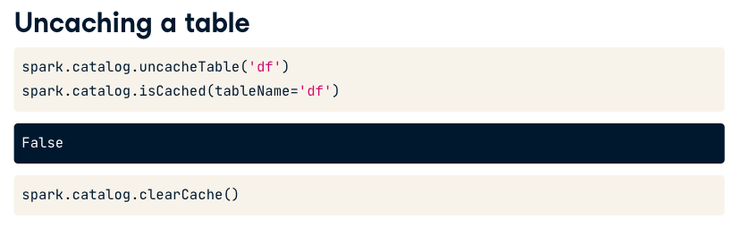

## Spark UI

web interface to inspect spark execution

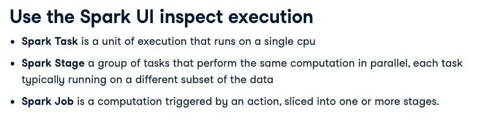

Spark webUI runs on the Spark Driver in the default port 4040, if this port is in use it'll try 4041, 4042, ...

## Logging

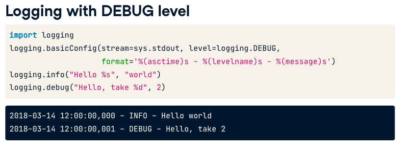

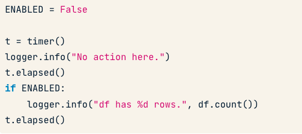

## Query Plans

`EXPLAIN SELECT * FROM table` or `df.explain()`: Provides information about the query plan without actually run it. It`s a set of steps used to acess the data.

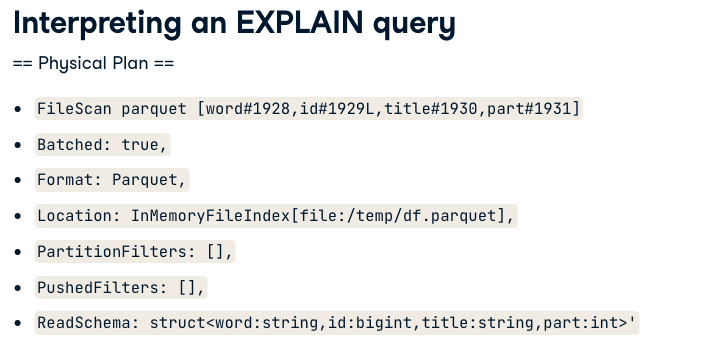
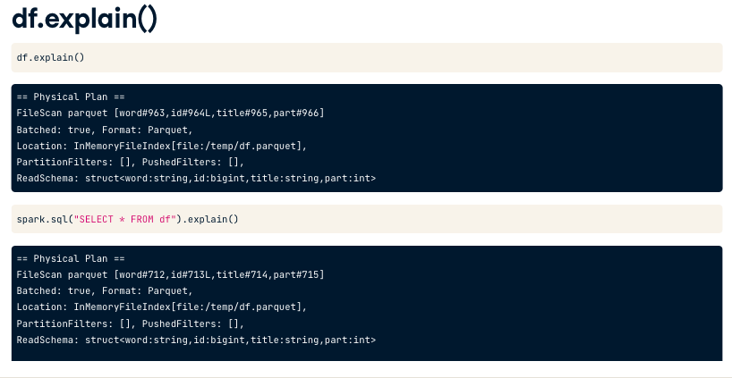

## Text classification

ETS: Extract,Transform and Select

Some Builtins:

```
from pyspark.sql.functions import split, explode, length

#Get the rows where there is an empty sentence
df.where(length('sentence') == 0)
```

When we don`t have a builtin we can set a UDF:

```
from pyspark.sql.functions import udf
from pyspark.sql.types import StringType, FloartType, ArrayType, IntegerType

def short():
    return "New-Column"

short_udf = udf('short', StringType())

df.withColumn('some_new_colum', short_udf()).show(3)
```

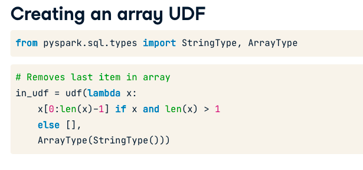

Sparse Vector Format

Array: `[1.0, 0.0, 0.0, 3.0]`
Sparse Vector: `([4, [0,3], [1.0,3.0])`
    - First Arg is the array length
    - Second Arg is the indices of the non-zero elements
    - Third arg is the non-zero values of the elements

To check if an object is a sparse vector you can use:
- hasattr(x, "toArray")
- x.numNonzeros()

```
# Returns true if the value is a nonempty vector
nonempty_udf = udf(lambda x:  
    True if (x and hasattr(x, "toArray") and x.numNonzeros())
    else False, BooleanType())

# Returns first element of the array as string
s_udf = udf(lambda x: str(x[0]) if (x and type(x) is list and len(x) > 0)
    else '', StringType())

```

```
# Show the rows where doc contains the item '5'
df_before.where(array_contains('doc', '5')).show()

# UDF removes items in TRIVIAL_TOKENS from array
rm_trivial_udf = udf(lambda x:
                     list(set(x) - TRIVIAL_TOKENS) if x
                     else x,
                     ArrayType(StringType()))

# Remove trivial tokens from 'in' and 'out' columns of df2
df_after = df_before.withColumn('in', rm_trivial_udf('in'))\
                    .withColumn('out', rm_trivial_udf('out'))

# Show the rows of df_after where doc contains the item '5'
df_after.where(array_contains('doc','5')).show()
```

### CountVectorizer

CountVectorizer is a feature extractor , Its input is an arrays of strings and its output is a SparseVector

```
from pyspark.ml.feature import CountVectorizer

cv = CountVectorizer(inputCol='words', outputCol='features')

model = cv.fit(df)
result = model.transform(df)
print(result)
```

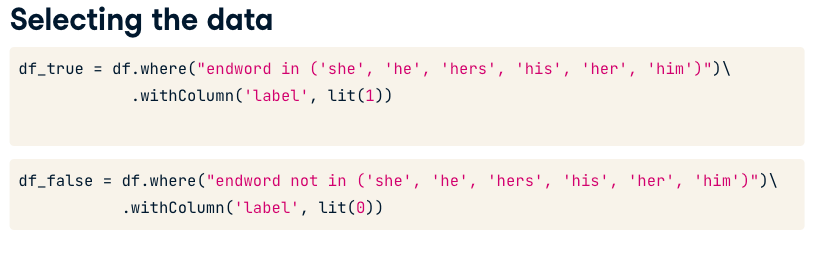

```
df_train, df_eval = df_examples.randomSplit((0.60, 0.40), 42)
```

from pyspark.ml.classification import LogisticRegression

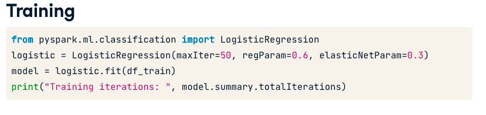