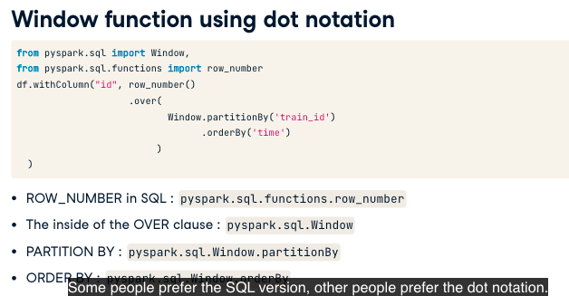

# Spark SQL

```
df = spark.read.csv('test.csv', header=True)
df.createOrReplaceTempView('schedule')
spark.sql(""SELECT * FROM schedule WHERE station='San Jose').show()
result = spark.sql("SHOW COLUMNS FROM tablename")
result = spark.sql("SELECT * FROM tablename LIMIT 0")
result = spark.sql("DESCRIBE tablename")
result.show()
print(result.columns)
```

## Window Function

```
query = """
SELECT train_id, station, time, 
LEAD(time,1) OVER (ORDER BY time) AS time_next
FROM sched
WHERE train_id=324"

# OR

query = """
SELECT train_id, station, time, 
LEAD(time,1) OVER (PARTITION BY train_id ORDER BY time) AS time_next
FROM sched
WHERE train_id=324"

```

## Dot notation and SQL

- `df.select('colA', 'colB')`
- `df.select(df.colA, df.colB)`
- `from pyspark.sql.functions import col`
    - `df.select(col('colA'), col('colB'))`

We can rename a column like these two forms:

- `df.select('train_id').withColumnRenamed('train_id', 'train')`
- `df.select(col('train_id').alias('train'))`

In SparkSQL we can use `AS` to rename columns.



