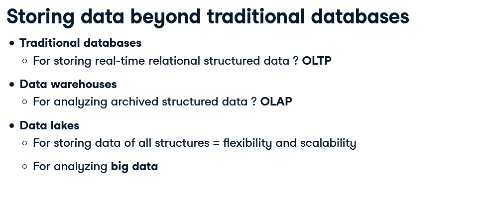
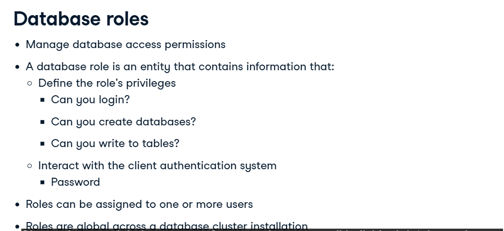

# OLTP & OLAP


## Storing Data

- Structured Data
  - Schema Enforced
  - Data types and relations
- Unstructured Data
  - Schemaless
  - Makes up most of data in the world
    - eg. Photos, Mp3, chat logs
- Semi-structured Data
  - Not follow a larger Schema
  - Self describe Structure
    - NoSQL, XML, JSON




## Database Design

Determines How data is logically stored
  - How data is going to be read an updated

- Use database models, like: relatinal model
  - Some others: NoSQL model, object-oriented model, network model
- Uses schemas: blueprint of the database
  - Defines tables, fields, relations, index, views

## Data Model

- Conceptual Data Model: describes entities, relationships and attributes: UML, diagrams, etc..

- Logical Data Model: defines tables, columns, relationships. (Databases models and schemas, eg. relational model, start schema, etc..)

- Physical data model: describes physical storage. (partitions, CPUs, indexes, backup system)


## Dimensional Modeling

- Fact Tables
  - Decide by business use-case
  - Holds record of a metric
  - Changes regularly
  - Connects to dimensions via foreign key
- Dimensional Tables
  - Holds description of attributes
  - Does not changes often

  

## Star and Snowflake Schema


Snowflake is just an extension of StartSchema, it has more tables.

Start Schema uses on dimension, SnowFlake use more dimensions. (Normalized: Reduce redundancy and increase data integrity)

A book can have a different Author, Publisher and genre, but a city remain in the same state and country


## Normalized and denormalized databases

- Normalization Saves Space, like SnowFlake Schema.
- Normalization enforces Data Consistency
- Safer updating, removing and inserting
- Easier to redesign by extending

The disadvantange of normalization is that it requires more CPU and queries are slower.

Using Default Values:

```
-- Add a continent_id column with default value

ALTER TABLE dim_country_sf
ADD continent_id int NOT NULL DEFAULT(1);

```

## Normal Forms


The problem here is that Courses_completed have more than on value in the same row.


The problem here is that the Instructor_id dos not depend on the Student_id
Solving it:


The problem we have non-key dependancy

Solving it:


Not using the máx norma form can cause data anomalies when update, deleting ou inserting.

## Granting and Revoking Example

`GRANT UPDATE ON ratings TO PUBLIC;`
`REVOKE INSERT ON films FROM db_user;`

```
-- Revoke everyone's update and insert privileges
REVOKE INSERT, UPDATE ON long_reviews FROM PUBLIC; 

-- Grant the editor update and insert privileges 
GRANT INSERT, UPDATE ON long_reviews TO editor; 

```

## Materialized View

Stores the query results not the query itself.

QUerying a materialized view means acessing the stored query results.

Refresh or rematerialized when prompted or scheduled

- Materialized views are good for queries that takes a lot of time to run.
- if data is updated often is not recommended to use materialized view.
- Materialized views are also good for Data warehouses, because OLAP is not write-intensive

**Creating and Refreshing Materialized View**
```
CREATE MATERIALIZED VIEW view_name AS
SELECT name FROM table;

REFRESH MATERIALIZED VIEW view_name;
```
There isn't a Postgres command to schedule a Materialized View Refresh, so you can use CRON.


When you have a lot of views dependency of one another, use Airflow or Luigi to orchestrate the Refresh in order to ensure that the Refresh goes from the correct order of dependency and to have all the tables with the most update data without any conflicts.

## DataBase Roles and Acess Control



**Creating a Role**

`CREATE ROLE data_analyst;`

Creating with some attributes

`CREATE ROLE intern WITH PASSWORD 'passinter' VALID UNTIL '2021-10-10' ;`

`CREATE ROLE admin CREATEDB;`

`CREATE ROLE admin WITH CREATEDB CREATEROLE;`

Altering Role Permission

`ALTER ROLE admin CREATEROLE;`
`ALTER ROLE marta WITH PASSWORD 's3cur3p@ssw0rd';`

Use `GRANT` and `REVOKE` to manage permissions for your role.

Like:

```
GRANT INSERT,UPDATE ON table TO data_analyst;
REVOKE INSERT,UPDATE ON table FROM data_analyst;
```

List of Priveleges Roles in Postgresql:

`SELECT`, `INSERT`, `UPDATE`, `DELETE`, `TRUNCATE`, `REFERENCES`, `TRIGGER`, `CREATE`, `CONNECT`, `TEMPORARY`, `EXECUTE` and `USAGE`


## Table Partitioning


**Partition is part of the physical data model.**

There are two types of partitioning: `Vertical` and `Horizontal`

**Vertical:**

It'll improve the query time as it'll scan less data.


**Horizontal Partition**


```
CREATE TABLE some_table (
  id serial PRIMARY KEY NOT NULL,
  name VARCHAR(255),
  timestamp DATE NOT NULL
)
PARTITION BY RANGE (timestamp);

CREATE TABLE sales_2019_q1 PARTITION OF some_table
FOR VALUES FROM ('2019-01-01') TO ('2019-03-31');
```

*To do this, we partition by LIST instead of RANGE. When creating the partitions, you should check if the values are IN a list of values. Instead use range to check if the value are within a range*

**When partition is applied to different machines it's called Sharding, it's used on MPP.**


## NOSQL AND SQL


