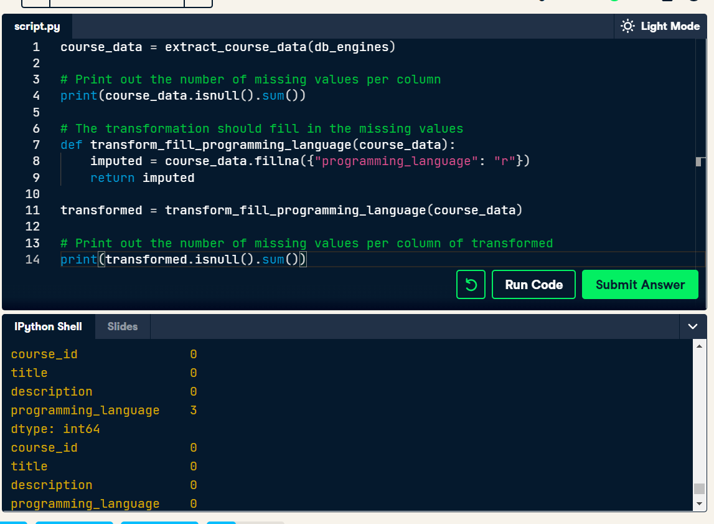

### Extract
You can pass the db-engine to some libs like pandas and sqlalchemy to perform
some queries.

Extract API using requests
Extract Database using SQLalchemy or pandas

Also explained very briefly about webAPI, JSON format, OLTP and OLAP.

Extract data using Spark from RDBMS

### Transform

Some examples
- Selection of an attribute (eg. email)

- Translation of code values (New york to NY)
- Data Validation (date input)
- Split columns into multiple columns
- Joining from multiple sources

#### MPP Databases

Tipically MPP load data better from colunas data files. CSV is NOT a good format for example.

Using parquet (colunas format) from pandas and pyspark

Sending this data to Redshift

Or load to SQL database like POstgres

## Filling Values

