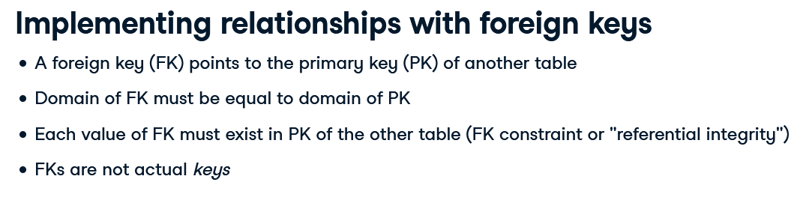

# Databases (RDBMS)

- Constraints
- Keys
- Referential Integrity

Schemas:

`SELECT table_schema, table_name FROM INFORMATION_SCHEMA.tables;`

Also columns informatino

`SELECT table_name, column_name, data_type FROM INFORMATION_SCHEMA.columns WHERE table_name='pg_config';`

Squares are `Entities` and `Circles` are attributes


### Creating a Table

```
CREATE TABLE TableA (
  fieldA typeA SomeConstraint,
  fieldB typeB...
);

```

### Alter Table

ALTER TABLE table_name
ADD COLUMN column_name data_type;

### Distinct and Insert Into

**Using Distinct**
`SELECT COUNT(DISTINCT organization) FROM table`

**Distinct and Insert using Select query**
`INSERT INTO organizations SELECT DISTINCT organization, organization_sector FROM university_professor`

**Insert Standard**

```
INSERT INTO table (a,b,c,d) VALUES ('','','','');
```

### Rename a Column

```
ALTER TABLE table
RENAME COLUMN name_old TO new_name;
```

### Drop a Column

```
ALTER TABLE table
DROP COLUMN column_name;
```

### Drop a Table

`DROP TABLE tablename;`

## Integrity Constraints

- attribute constraints (datatypes)
- Key constraints (primary keys)
- Referential Integrity Constraints (Foreign Key)


The most common types:

- boolean
- char [(x)]
- varchar [(x)]
- text
- date
- time
- timestamp
- numeric
- integer

**Specyfing Types**

CREATE TABLE students (
  ssn integer,
  name varchar(64),
  dob date,
  average_grade numeric(3,2),
  tuition_paid boolean
)

**Altering column type**

ALTER TABLE students 
ALTER COLUMN ssn TYPE numeric;


ALTER TABLE students 
COLUMN ssn TYPE numeric
-- Turns 5.54 into 6, not 5, before type conversion
USING ROUND(ssn);

## NOT NULL

CREATE TABLE students (
  ssn integer not null,
  name varchar(64) not null,
  dob date,
  average_grade numeric(3,2),
  tuition_paid boolean
)

**IMPORTANT NOTE**: Comparing NULL with NULL generates always false results, because there is no underlying value from it.

You can also Alter the table to add NOT NULL constraint:

```
ALTER TABLE students 
ALTER COLUMN dob 
SET NOT NULL;
```

To remove NOT NULL constraint

```
ALTER TABLE students
ALTER COLUMN dob
DROP NOT NULL;
```

## UNIQUE CONSTRAINTS

```
CREATE TABLE table_name (
  column_name UNIQUE
);

ALTER TABLE table_name
ADD CONSTRAINT some_name UNIQUE(column_name)

```

# Keys and superkeys


Attributes that identify a record uniquely

Superkeys is when you have a set of attributes that makes the superkey unique, the minimal superkey is the superkey with the minimal attributes and these are classified as the candidates keys

Primary Key Never Change!

**Primary Key**: Unique Identify records in a Table, chosen by candidate keys. Don't accept null or duplicate 

```
CREATE TABLE products (
  product_no integer UNIQUE NOT NULL,
  name text,
  price numeric
);

CREATE TABLE products (
  product_no integer PRIMARY KEY,
  name text,
  price numeric
);

--Multiple keys
CREATE TABLE example (
  a integer,
  b integer,
  c integer,
  PRIMARY KEY (a,c)
);

```

**Altering a Table to add Primary Key**

```
ALTER TABLE table_a
ADD CONSTRAINT primary_key_some_name PRIMARY KEY (somecolumn)
```

## Surrogate Keys

There is a special type on Postgres called Serial Type, that is an auto-incremental type that is used when you don't have any specific field that meets a Primary Key value requirements.

```
ALTER TABLE table_a
ADD COLUMN id serial PRIMARY KEY;
```

Another Type of Surrogate Key is to combine two columns into one. Like:

```
ALTER TABLE table_name
ADD COLUMN column_c varchar(256)

UPDATE table_name
SET column_c = CONCAT (column_a, column_b);

ALTER TABLE table_name
ADD CONSTRAINT pk PRIMARY KEY (column_c)

```

## Model 1:N



**Creating Foreign Keys**
```
CREATE TABLE manufacturers (
  name VARCHAR(255) PRIMARY KEY
);

CREATE TABLE cars  (
  name VARCHAR(255) PRIMARY KEY,
  mnf_name VARCHAR(255) REFERENCES manufacturers(name)
);
```
**Adding Foreign Keys to an Existing Table**

```
ALTER TABLE cars
ADD CONSTRAINT some_fk FOREIGN KEY (car_id) REFERENCES manufacturers (name)
```

## Database Model


## Update Table from Another One

**Here's a way to update columns of a table based on values in another table:**
```
UPDATE affiliations
SET professor_id = professors.id
FROM professors
WHERE affiliations.firstname = professors.firstname AND affiliations.lastname = professors.lastname;

```