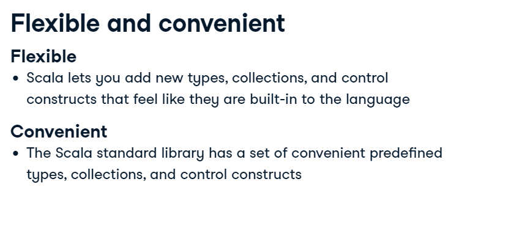
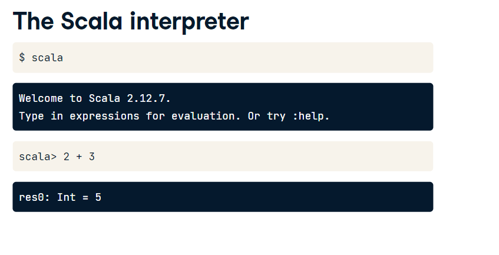
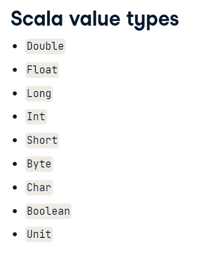
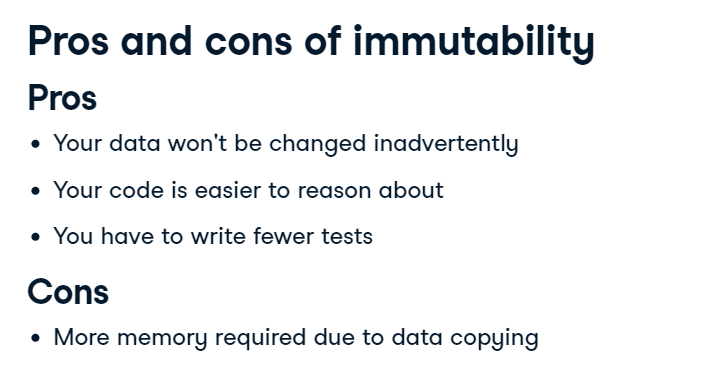
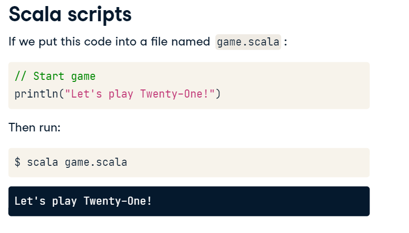

# A Scalable Language

Scala is a general multi-purpose language providing support for functional programming and a strong static type system.

`Scale source code` is intended to be compiled to Java bytecode, so that the resulting executable code run on a `Java Virtual Machine`

Scala is an flexible and adaptable language, so it's not complete, but very adaptable for your requirements.




**Spache Spark was Written in Scala**

[**Scala Official Website**](https://www.scala-lang.org/)


Scala fuses OOP and FP more than any language in the world. -> Scala is scalable

- Every value is an object
- Every operation is a method call
- Functions are first-call calues like int, str
- Operations of a program should map input values to output values rathen than change data in place. (functions should have no side effect)

### Why use Scala

- Concise: reduce the lines in 1/10 compared to Java
- High-Level Language: Won't deal with computer detail
- Advanced Static Type System: avoid bug in complex applications
- It's Compatible: Access to huge ecosystems of libraries due to running in a JVM.

### Scala Interpreter



```
// Calculate the difference between 8 and 5
val difference = 8.-(5)

// Print the difference
println(difference)

```

### Variables

Mutable: `val`
Immutable: `var`

`scala> val fourHearts: Int = 4`



`String type is a sequence of Char in Scala`

```
// Define immutable variables for clubs 2♣ through 4♣
val twoClubs: Int = 2
val threeClubs: Int = 3
val fourClubs: Int = 4

val PlayeA: String = "Guilherme"

```



**Scala have the Type Inference Feature which detects the type of the object and assign it automatically if not declared, it applies to everything: functions, collections, etc...**
```
val FourHearts: Int = 4
// With Type Inference
val Five Hearts = 5

```

```
// Create a mutable variable for Alex as player A
var playerA: String = "Alex"

// Change the point value of A♦ from 1 to 11
aceDiamonds = 11

// Calculate hand value for J♣ and A♦
println(jackClubs + aceDiamonds)

```



## Interpreter and Compiled Language

Scala Application must be compiled explicited and run explicited.
Scripts can be executed using scala command and it`ll be interpreted (it`ll be slower than compiled).

Compiled >
- No lag time as application is pre-compiled
- Good for larger applications

```
object Game extends App {
  println("test Game")
}
```

`$scalac Game.scala`

`$scala Game`

Output > test Game

## IDE

You can work with Scala using shell scripting or an IDE, the most preferable IDE for Scala is Intellij IDEA.

## SBT (Simple Build Tool)

Most popular tool for building Scala Application. It compiles, run and test your Scala Application.

## Scala on Jupyter Notebooks

Scala also works on Jupyter Notebooks using Kernel Almond

# Functions

Functions are invoked with a list of arguments to produce a result.

What are the parts of a function?

- Parameter List
- Body
- Result Type

Definition

```
// function body
def bust(hand: Int): Boolean = {
  hand > 21
 }

print(bust(20))
print(bust(21))
print(bust(1+4))
// false
// true
// false
```

**functions in scala can receive other functions as arguments**

# Arrays

## Collections

- Mutable collections
  - can be updated or extended in place
- Immutable collections
  - never change
 
 Array is a mutable sequence of objects that share the same type
 
 `scala> val players = Array("Alex", "Chen", "Marta")`
 OR
 `scala> val players = new Array[String](3)`
 OR
 `scala> val player: Array[String] = new Array[String](3)`
 
 Adding elements to Array:
 ```
 scala> players(0)="Guilherme"
 scala> player(1)="Joao"
 ```
 
 Arrays have order and type defined!
 
 **It`s recommended to use val with Array to be able to update the Array like above, but cannot reassign the variable with a new array like players= new Array[String](5)**
 
 Scala nudges us towards immutability.
 
 **The any supertype**
 
 `scala> val mixedTypes = new Array[Any](3)`
 `scala> mixedTypes(0) = 1`
 `scala> mixedTypes(1)="Teste"`
 
 ```
 // Initialize player's hand and print out hands before each player hits
hands(0) = tenClubs + fourDiamonds
hands(1) = nineSpades + nineHearts
hands(2) = twoClubs + threeSpades
hands.foreach(println)

// Add 5♣ to the first player's hand
hands(0) = hands(0) + fiveClubs

// Add Q♠ to the second player's hand
hands(1)  = hands(1)  + queenSpades

// Add K♣ to the third player's hand
hands(2)  = hands(2)  + kingClubs

// Print out hands after each player hits
hands.foreach(println)
 
 ```
 
 ## Lists
 
 Most common collection in scala. List is immutable sequence of objects with the same type.
 
 List have a type parameter: 
 
 `scala> val player = List("Alex", "Chen", "Marta")`
 
 List has methods, like all of Scala collections.
 - Method: a function that belongs to an object.

Some list methods:
- myList.drop()
- myList.mkString('','')
- myList.length
- myList.reverse

In order to prepend item to the beggining of a list just use double collon `::` called `cons` like:

`scala> val players = List("Guilherme", "Pedro")`

`scala> val newPlayers = "Master"::players`

or you can change `val` to `var`, so you can add the values to the same variable.

## Nil

A common way to initialize lists is by using `Nil`, like:

`scala> val players = "Alex"::"Chen"::"Marta":: Nil`

## Concatenate Lists

Using the `:::` operator you can concatenate lists, e.g:

```
val playersA = List("Sindhu", "Alex")
val playersB = List("Chen", "Marta")
val allPlayers = playersA ::: playersB
println(playersA + " and " + playersB + " were not mutated,")
println("which means " + allPlayers + " is a new list")
```

## Scala Static Type System


- Type: restricts the possible values to which a variable can refer, or an expression can produce, at run time

- Compile time: when source code is translated into machine code, i.e, code that a computer can read

- Run time: when the program is executing commands (after compilation, if compiled)

**Static Type Systems**: a Language is statically typed if the type of a variable is known at compile time. That is, types checked before run-time. like: C/C++, Fortran, Java and Scala

*Pros*

- Increased performance
- Properties of your program verified (prove the absence of common type-related bugs)
- Safe refactorings
- Documentation in the form of type annotation (:Int in val fourHearts: Int = 4)

*Cons*

- It takes time to check types
- Code is verbose 
- The language is not flexible

**Dynamic type systems**: A Language is dynamically types if types are checked on the fly. That is, types are checked during execution. (i.e runtime): Javascript, Python, Ruby, R.

## Control Structures

A control structure is a block of programming that analyses variables and chooses a direction in which to go based on given parameters. The term flow control details the direction the program takes (which way program control flows)

`if`/`else`

```
val hand = 24
if (hand > 21) {
  println("this hand busts")
}
else {
  println("not busts")
}

def maxHand(handA: Int, handB: Int): Int = {
  if (handA > handB) handA
  else handB

// OR pay attention 100 limit char per line ** just a convention
def maxHand(handA: Int, handB: Int): Int = {
  if (handA > handB) handA else handB

```

**Using Else Ifs:**

```
val handA = 26
val handB = 20

if(bust(handA) & bust(handB)) println(0)
else if(bust(handA)) println(handB)
else if(bust(handB)) println(handA)
else println(handB)

val maxHand = if(handA > handB) handA else handB

```

```
// Point value of a player's hand
val hand = sevenClubs + kingDiamonds + threeSpades

// Inform a player where their current hand stands
val informPlayer: String = {
  if(hand > 21)
    "Bust! :("
  else if(hand == 21)
    "Twenty-One! :)"
  else
    "Hit or stay?"
}

// Print the message
print(informPlayer)

```

```
// Find the number of points that will cause a bust
def pointsToBust(hand: Int): Int = {
  // If the hand is a bust, 0 points remain
  if(hand > 21)
    0
  // Otherwise, calculate the difference between 21 and the current hand
  else
    21 - hand
}

// Test pointsToBust with 10♠ and 5♣
val myHandPointsToBust = pointsToBust(15)
println(myHandPointsToBust)

```

## Other Control Structures

Loop with while

```
var i = 0

val numRepetitions = 3

while (i < numRepetitions) {
  println("Hip hip Hooray!")
  i = i + 1
}
OR

val newList = "Aha"::"haahhaa"::"asdas"::Nil

var i = 0
while (i < newList.length) {
  println("hip hip hooray!")
  i = i + 1
}
```

# Functional Style

Scala usually is functional but can also be imperative.
1. Functions are first-class values
2. Operations of a programa should map input values to output values rather than change data in place.

Imperative means >
- One command at a time
- Iterate with loops
- Mutate shared state (e.g., mutating variables out of scope)
Ex: C, Java, Python

## Foreach

```
val someNames = ("Guilherme", "Joao", "Jose")

someNames.foreach(println)
```

**Side Effect**: should be avoided, code modyfing some variable outside of its local scope

Imperative: `var`, `Side Effects`, `Unit`

Functional: `val`, `No side Effects`, `Non-unit` value types: Int, Boolean, Double
