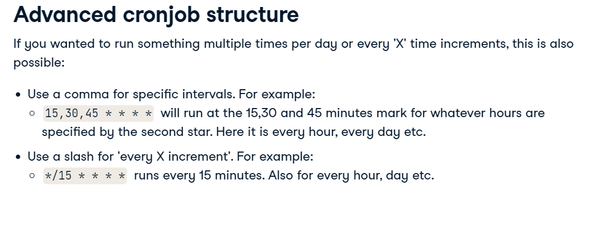

# Bash Scripting

Bash stands for (Bourne again Shell) (a pun)

some commands:

- grep
- cat
- tail / head (-n lines)
- wc: word count line (with flasgs w/l)
- sed: does pattern-matched string replacement

You can use `grep 'a' text.txt` or `grep [ab] text.txt`

Filter two patterns in grep

`grep -e pattern1 -e pattern2`

`grep 'pattern1\|pattern2'`

`egrep 'pattern1|pattern2'`

## Bash Script

Generally starts with `#!/usr/bash` (shebang) to your interpreter know it is a Bash script and uses the bash located at: `/usr/bash`, bash could be at a different location, you can check with `which bash` such as `/bin/bash`

## SED

```cat soccer_scores.csv | sed 's/Cherno/Cherno City/g' | sed 's/Arda/Arda United/g' > soccer_scores_edited.csv```

/g: global

/1: first occurence in line

/2: second occurence in line

1 s/[pattern]/g: first line

1,10 s/[pattern]/g: from first line to 10th line


## STDIN, STDOUT, STDERR


## Arguments

**$#** : give the number os arguments

**\$@ or $**: give all the arguments

**$1, $2, $n..**: get the nth argument.

## Variables 


there's also another option to run a sheel within a shell, you can use `$(command)` or just backticks \``command`\`

## Expressions

Bash does not support arithmetic expressions, you can use `expr` to solve it.

Example: `expr 1 + 4` or you can use parenthesis `$((1 + 4))`

Limitations: Cannot handle decimal places.

**bc** can be used instead of **expr** to handle decimal places

Example: `echo "7 + 5.5" | bc`

bc has another arg called scale to include decimal places.

Example: `echo "scale=3; 10 / 3" | bc` 

returns: 3.333

## Arrays

### Index Arrays

Index array, like python list

creating and assigning

`my_first_array=(1 2 3)`

declaring

`declare -a my_first_array`

In order to select an element in an array you need to:

`${my_first_array[2]}` to select 2th element

OR

`${my_first_array[@]}` to select all elements

The length of an array can be selected by adding an `#` to the beggining of the name.

`${#my_first_array[@]}`

To change an element use index-notation:

`my_first_array[1]=999`

Also it's possible to select just some elements of an array by subsetting:

`${my_first_array[@]:1:2}`

In order to append one element to an array:

`$my_first_array+=(10)`

### Associative Arrays

Similar to python dictionaries. Only available on bash 4 onwards. check with `bash --version`

creating an associative array:

`declare -A city_details=([city_name]="New York" [population]=1000000)`

`echo ${!city_details[@]}` show the keys

`echo ${city_details[@]}` show the values

### Create empty associative array

declare -A model_metrics

### Add the key-value pairs
```
model_metrics[model_accuracy]=(98)
model_metrics[model_name]=("knn")
model_metrics[model_f1]=(0.82)
```

## IF Statement


we can use double parenthesis to evaluate arithmetic conditions like:

```
x=10
if(($x > 10)); then
  echo "x: $x is greater than 10"
else
  echo "x: $x is not greater than 10"
fi

```
You can also use special flags other than regular operators (>, =, <, etc..)


Example:
```
x=10
if [ $x -gt 10 ]; then
  echo "x: $x is greater than 10"
else
  echo "x: $x is not greater than 10"
fi

```
Other useful conditional flags:


## OR AND

AND => `&&`

OR => `||`

Example:
```
x=10
if [ $x -gt 10 ] && [ $x -lt 20 ]; then
  echo "x: $x is greater than 10"
else
  echo "x: $x is not greater than 10"
fi

```

OR

```
x=10
if [[ $x -gt 10 && $x -lt 20 ]]; then
  echo "x: $x is greater than 10"
else
  echo "x: $x is not greater than 10"
fi

```


## Regex
https://regex101.com/

## FOR LOOPS AND WHILE

```
for x in 1 2 3
do
  echo $x
done

OR

for x in 123; do echo $x; done
```

To use ranges you can run: `for x in {1..3000..1}; do echo $x; done` where {start..end..increment}

Another way to use range is three expression:

`for((x=2;x<=100;x+=2));do echo $x; done`


### While

```
x=2

while[ $x -le 10 ];
do
  echo $x
  ((x+=1))
done

```

## CASE


```
# Create a CASE statement matching the first ARGV element

case $1 in
  # Match on all weekdays
  Monday|Tuesday|Wednesday|Thursday|Friday)
  echo "It is a Weekday!";;
  # Match on all weekend days
  Saturday|Sunday)
  echo "It is a Weekend!";;
  # Create a default
  *) 
  echo "Not a day!";;
esac

```

## Functions in Bash


```
# Create function
function what_day_is_it {

  # Parse the results of date
  current_day=$(date | cut -d " " -f1)

  # Echo the result
  echo $current_day
}

# Call the function
what_day_is_it

```

Passing args: $1, $@, $*, $#: works as args to a scripts but locally

```
function print_hello () {  echo $1; }

print_hello "Olá Mundo!"
```

**Be aware!** : bash by default all variables are global, to avoid any mistakes declare `local` variables inside loops and functions.

`local variablename=10`

**Functions can't return regular values, just 0 if successful or 1-255 if not, this value is captured in a global variable `$?`.**

In order to capture the value we could:

1. Assign to a global variable
2. `echo` what we want back (last line of the function) and capture using shell-shell


Example:

Assign the return value to a variable using echo
```
# Create a function 
function return_percentage () {

  # Calculate the percentage using bc
  percent=$(echo "scale=2; 100 * $1 / $2" | bc)

  # Return the calculated percentage
  echo $percent
}

# Call the function with 456 and 632 and echo the result
return_test=$(return_percentage 456 632)
echo "456 out of 632 as a percent is $return_test%"
```

Another way to return a value from a Function form a global variable

```
# Create a function
function get_number_wins () {

  # Filter aggregate results by argument
  win_stats=$(cat soccer_scores.csv | cut -d "," -f2 | egrep -v 'Winner'| sort | uniq -c | egrep "$1")

}

# Call the function with specified argument
get_number_wins "Etar"

# Print out the global variable
echo "The aggregated stats are: $win_stats"

```

## Functions with Array Example

```
# Create a function with a local base variable
function sum_array () {
  local sum=0
  # Loop through, adding to base variable
  for number in "$@"
  do
    sum=$(echo "$sum + $number" | bc)
  done
  # Echo back the result
  echo $sum
  }
# Call function with array
test_array=(14 12 23.5 16 19.34)
total=$(sum_array "${test_array[@]}")
echo "The total sum of the test array is $total"
```

## CRON

it is driven by somwthing called `crontab`, which is a file that contains `cronjobs`, which each tell `crontab` what code to run and when

`crontab -l` to see cronjobs scheduled
`crontab -e` to edit cronjobs list


