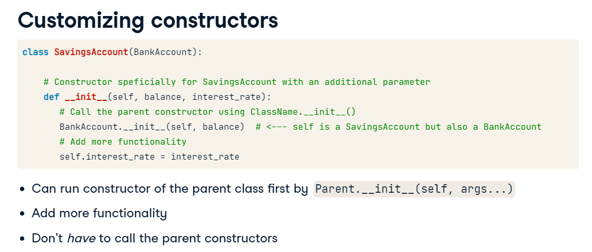

# OOP Fundamentals

Objects as data structures => state + behavior


- Everything in Python is an object
- Every object has a Class


you can use `type` to find out the object class


you can use `dir` to access all the attributes and methods of a python object

another tip is to use `help(x)` to get more information about the object

### self

when you pass object.method() it's like passing the object itself as an argument to the method.


### __INIT__


# Inheritance and Polymorphism

Class attribute can be used as a global attribute to all objects and it's all in CAPS. for example, the minimum salary, it's shared across all employess.

It's recommended for:
- min/max values
- constants like: pi for a Circle class, etc..

### Class Methods

It's used as an alternative constructor. different from a normal method in a class it has `cls` instead of `self` and also a decorator called `classmethod`

```
class Employee:
  MIN_SALARY=10000
  def __init__(self, name):
    self.name = name
  @classmethod
  def init_admin(cls, name_adm):
    return cls(f"admin-{name_adm}")

```
**Another Example**

```
class BetterDate:    
    # Constructor
    def __init__(self, year, month, day):
      # Recall that Python allows multiple variable assignments in one line
      self.year, self.month, self.day = year, month, day
    
    # Define a class method from_str
    @classmethod
    def from_str(cls, datestr):
        # Split the string at "-" and convert each part to integer
        parts = datestr.split("-")
        year, month, day = int(parts[0]), int(parts[1]), int(parts[2])
        # Return the class instance
        return cls(year, month, day)
        
bd = BetterDate.from_str('2020-04-30')   
print(bd.year)
print(bd.month)
print(bd.day)
```

Changing the class attribute in an instance only change the value in the instance. In order to change the attribute globally to all instances it's necessary to change the class attribute itself like:

```
# Create Players p1 and p2
p1, p2 = Player(), Player()

print("MAX_SPEED of p1 and p2 before assignment:")
# Print p1.MAX_SPEED and p2.MAX_SPEED
print(p1.MAX_SPEED)
print(p2.MAX_SPEED)

# ---MODIFY THIS LINE--- 
Player.MAX_SPEED = 7

print("MAX_SPEED of p1 and p2 after assignment:")
# Print p1.MAX_SPEED and p2.MAX_SPEED
print(p1.MAX_SPEED)
print(p2.MAX_SPEED)

print("MAX_SPEED of Player:")
# Print Player.MAX_SPEED
print(Player.MAX_SPEED)

outputs:

MAX_SPEED of p1 and p2 before assignment:
3
3
MAX_SPEED of p1 and p2 after assignment:
7
7
MAX_SPEED of Player:
7

```

## Inheritance

Get an old class functionality and add some extra feature to create a new class functionality


Inheritance "`is-a`" relationship like, Saving Account is a BankAccount.

if you try `isinstance` Python will treat the child as the child type but also the parent type.
It's not the same for the BankAccount Object which is not the Child type SavingAccount.


## Customizing Constructors/attributes in a child

It'll be needed to import the init method from the parent and then add the desired attributes for the child.

for instance:

```
class Employee:
  def __init__(self, name):
    self.name = name

class Manager(Employee):
  def __init__(self, name, authority):
    Employee.__init__(self, name)
    self.authority = authority

```



## Customizing Methods in a child from parent


# Integrating with Standard Python

## Operator Overloading: comparison

**we can't compare custom objects from custom classes like: p1 == p2, because it's compare the memory chunk position not the objects values, even they have the same attribute values.**

But, it works with some classes like pandas and numpy we can compare: like:

>array1 = np.array([1,2,3])

>array2 = np.array([1,2,3])

>array1 == array2

`True`

### There is a special method for this: `__eq__`
it's called whenever two objects of the same class is compared using ==, it accepts 2 args, self and other - objects to compare, it always returns a boolean value


Python always calls the child's __eq__() method when comparing a child object to a parent object.

# Operator overloading: string representation

There are two special methods that we can define in a class that will return printable representation of an object: `__str__()`: informal para the end users and `__repr__()` for developers


__repr__ is a fallback if str is not implemented.


good practice to keep repr equals class implementation

# Exceptions


You can use `Raise` to raise and stop program execution, the user that is using the code can decide what to do with this type of error


# Best Practices of Class Design


# Managing data access: private attributes


For convention you can use underscore in front of your class or function that is supposed to be private, it's not prevent to use it, but it's a signal to developer do not touch it. Pandas has one example, df._is_mixed_type()

`__` double underscore The closest thing Python has of a private "fields" and methods of other programming languages. It's useful to prevent inheritance to modify functions that is protected. do not use __method__


