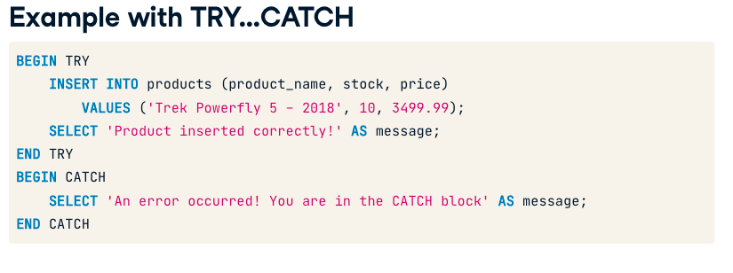
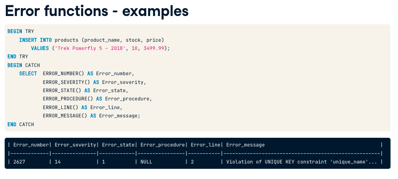
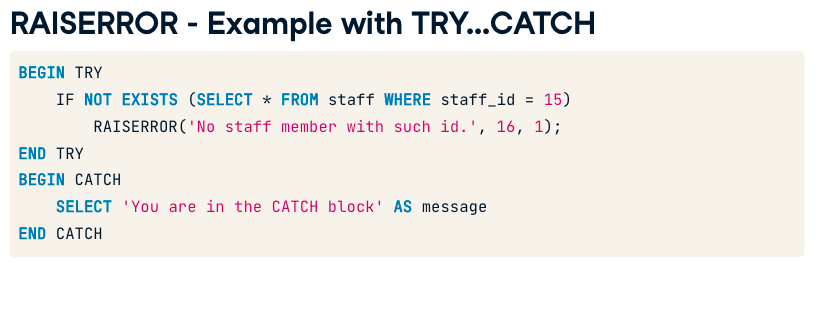
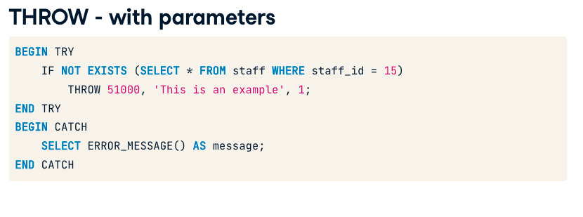

# Transaction Error Handling SQL Server

CONSTRAINT unique_product_name UNIQUE (product_name)




### Error Msgs

```SELECT * FROM sys.messages```





```
DECLARE @product_id INT = 5;

IF NOT EXISTS (SELECT * FROM products WHERE product_id = @product_id)
	-- Invoke RAISERROR with parameters
	RAISERROR('No product with id %d.', 11, 1, @product_id);
ELSE 
	SELECT * FROM products WHERE product_id = @product_id;
```

