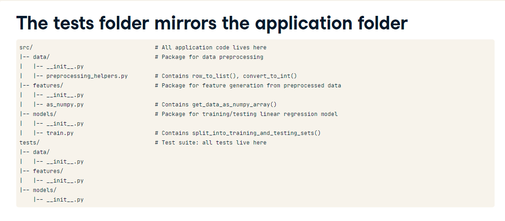

# Unit Testing basics

Most used Python Unit Test libraries:

- pytest
- unittest
- nosetests
- doctest

Pytest is the most popular one.

## Starting

When you create a python file with `test_` before the name pytest understand that it's not a regular python script. Must sure to follow this name convention for testing and to pytest identify the files.

Files holding unit tests are called test modules.

We first import pytest and then the function to test:

```
import pytest
import func_to_test

def test_for_clean_row():
  assert row_to_list("arg1") == ["arg1"]

def test_for_missing_area():
  assert row_to_list("/asddi") is None

def test_for_missing_tab():
  assert row_to_list("/tab") is None
```

Note that the function also starts with the preffix `test_`

Every test should have `assert` call.

`Assert` can take any Boolean expression.

## Running test

`pytest test_row_to_list.py`

Notes: You can run any shell command in IPython by using `!` before the coomand, like `!pytest test_row_to_list.py`


**Important Note**: Unit testing serve as documentation

## Definitions:

**Unit test:** Unit is a small, independent piece of code, it can be a function or a class.
**Integration Test:** Check if multiple unit tests work well when they are connected. like one system feature.
**End-to-end Test**: Test the whole software at once. they start from one end to the other.

## Assert Statement

you can include a message as second parameter in `assert` statement like: `assert 1==2, "1 it'll never be equals 2"`

**Does not compare float like assert 0.1+0.1+0.1 == 0.3 it'll throw an error**

Use `pytest.approx()` instead, like: `assert 0.1+0.1+0.1 == pytest.approx(0.3)`

It also works with numpy array, `assert np.array([0.1+0.1, 0.1+0.1]) == pytest.approx(np.array[0.2,0.3])`

Note: We can have more than on `assert` in the function like, one assert to validate the type, and one assert to validate the value;

## Testing for exceptions instead of return values

You can use `pytest.raises(ErrorTypeName)` to evaluate exceptions on your unit testing.
Example:

```
with pytest.raises(ValueError):
  raise ValueError #Context exit with a ValueError
  # pytest silence it
```

```
with pytest.raises(ValueError):
  pass #Context exit without an ValueError
  #pytest raises Failed
```


# How much elements we need to test?

Focus on:

- Bad arguments : when a function returns an exception instead of a value (one bad type like: instead passing a dict pass a list, missing rows, etc..)
- Special arguments: it has two types
  - Boundary Args: arguments that mark a start a behaviours
  - Special Logic: arguments that trigger a different path in a function
- Normal arguments: All the arguments not those above. It's recommended to test 3 or 4 normal arguments.


**Caveat**: Not all functions has special or bad args.


# TDD

It's recommended to have this streucture of src and test folder.
test folder must be a clone of src


In order to have a clean organization of tests, we need to use `test class`


In your CI/CD pipeline you can run `pytest -x` in order to stop when the first test failed.

In order to run the tests just for one class you can use: `pytest file.py::TestnameOfTheClass` or to run one function `pytest file.py::TestnameOfTheClass::test_name_of_func`

It's also possible use `pytest -k 'TestnameOfTheClass'` as it can find patterns to run the tests.

It can be used python operators also like: `pytest -k 'Testname and not test_func'`

# Expecting failures and conditional skip

there is a decorator on pytest called: `@pytest.mark.fail` which can make the tests not failed but xfailed not causing red alerts.

It can also receives an argument to tell the reason in the console: `@pytest.mark.fail(reason='TDD, This function is planned to be done next week')`


## Skipping

It's necessary when for example running on Windows or differente version of Python or others related to the environment.

There is also a decorator called: `pytest.mark.skipif(boolean expression)`

In order to build the boolean expression import `sys` and then you can check the system like:

```
import sys

@pytest.mark.skipif(sys.version.info > (2, 7))
```

`pytest -rsx` will show all the messages from skip and failx.

**The decorators can also be applied to classes**

# Travis CI

Install it free in github from marketplace. It's free just for public projects.


Codecov is a website that store the files when pushing CI/CD. you can add Codecov in the marketplace github.com and ensure to have codecov after success pipeline run to upload the report to codecov.io.

**To get the badges to include in README go to settings and copy the markdown.**

# Beyond Assertion: setup and teardown

Sometimes you need to prepare the environment before running tests, like create a file, etc...
Setup means to generate that files and teardown means remove files after test is completed.

New Workflow

`setup -> assert -> teardown`

In python we use fixture to create the setup and teardown in a function different


`tmpdir` as the argument of the @pytest.fixture function creates a temporary directory and it'll automatically removed after the execution block, so does not need teardown commands.


# Mocking

we'll need two libs:

- pytest-mock
- unittest.mock

Replace a dependant function to `unittest.mock.MagiMock()` this replacement is done using a fixture called `mocker` and calling its method `patch` that receives the fully qualified name of the dependency including module name "data.preprocessing_helpers.row_to_list"


There is also a way to get all the arguments from the functions using `call_args_list` you need to import `from unittest.mock import call`


# Testing Models

Testing models it's hard because it's hard to know the answer prior to the calculation return, that's applied to all models, regression, neural networking, random forest,

We have some tricks to test

- 1: Use a simple known dataset:


- 2: Inequalities (<, >, !=,)


# Testing plots

install `pip install pytest-mpl`


to run the tests to compare the image needs to run `pytest file.py --mpl`

Example Image test
