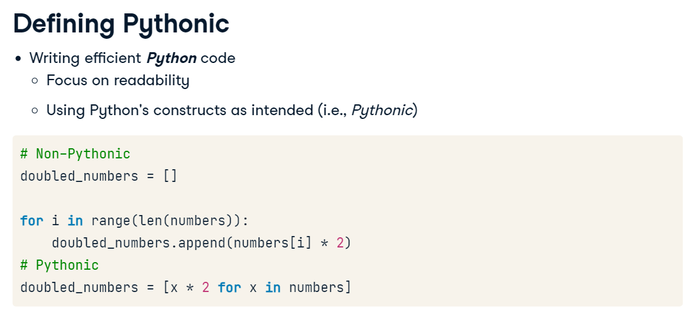
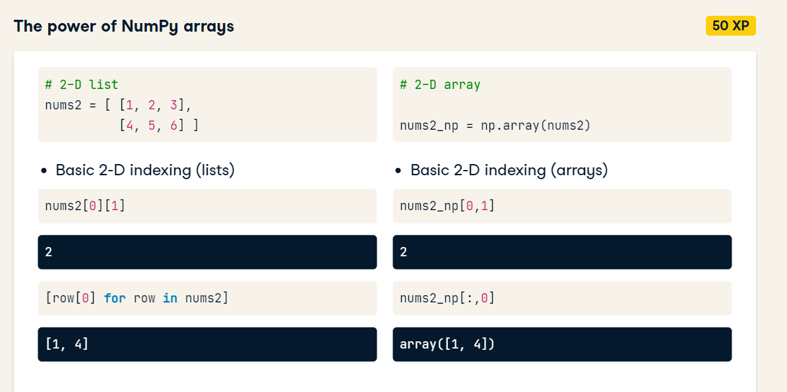
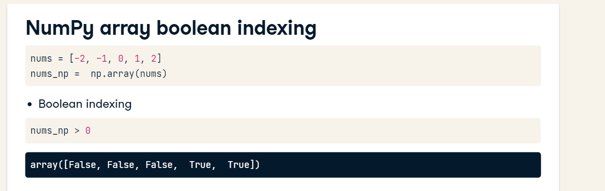

# Notes

Writing Efficient Python Code

- Minimal completion time (fast runtime)
- MInimal resource consumption (small memory footprint)

The objective is to reduce latency and overhead.

### Focus on writing Pythonic Code

Pythonic code is more efficient, it takes less time to run

### Range function
In python 2 range function returns a list, in python 3 it was changed to an object to reduce memory consumption. So, you range has __iter__ attribute which can be converted to a list, tuple, set, etc...
like: list(range(1,5))

### NumPy

Provides a fast and memory efficient alternative for Python lists.

NumPy arrays are homogeneous which means only allows element of the same type: [1,2,3,4] or ['a', 'b', 'c']

To use numpy array is simple like:

import numpy as np
simple_array = np.array([1,2,3])

if you create an array like, [1,2.5,3], numpy will convert to float64, to keep its homogeneity, so to be more memory efficient and faster than python list. basically, it eliminate the overhead needed of type checking.

Python Lists does not allow to perform broadcasting operations on lists, like:

a = [1,2,3]
b = a**2

Return an ERROR

it'll be needed to loop like:

b = [num**2 for num in a]

Numpy Array allows to multiply it directly, it called array broadcasting, which is more efficient, like

a = np.array([1,2,3])
b = a**2

Other advantage of Numpy is 2d array subsetting:

Another Advantange is boolean indexing: (in the python list it'll be required a for loop)

