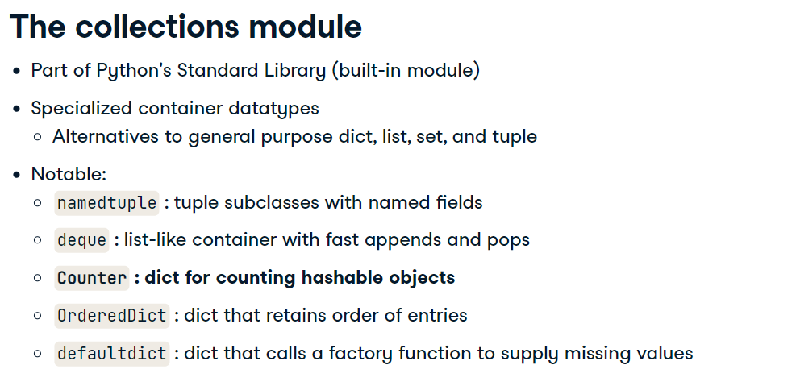
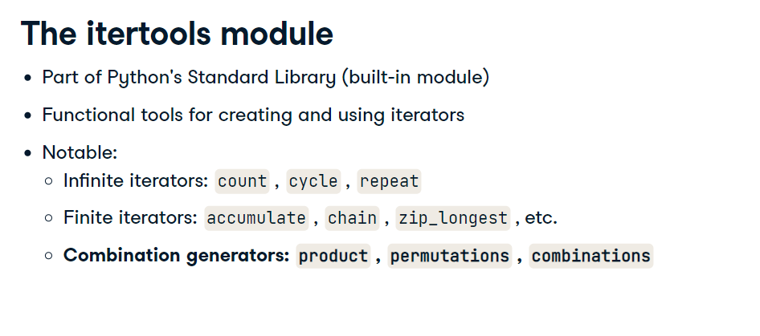
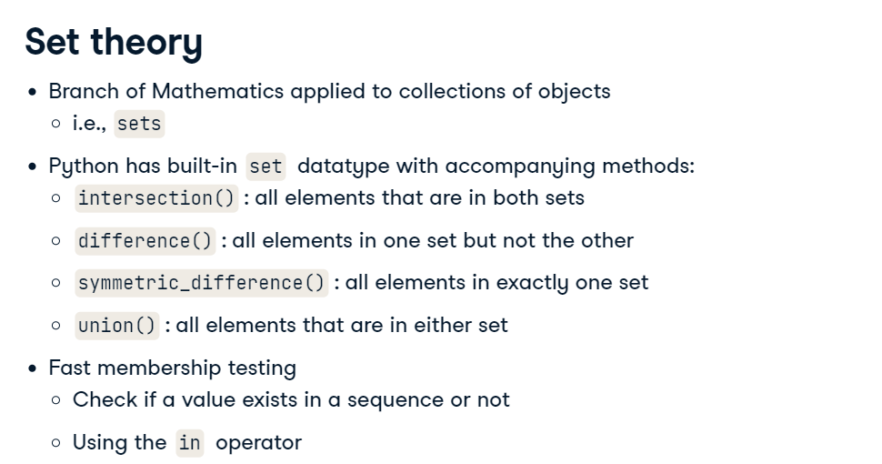

# Gaining Efficiency

## Combining Objects with ZIP builtin function


```
names = ['Bulbasaur', 'charmander', 'pikachu']
hps = [100,50,10]

combined = zip(names, hps)
print([*combined])
```
`Out[13]: [('Bulbasaur', 100), ('charmander', 50), ('pikachu', 10)]`




Using Collection Counter

```
poke_types=['Grass', 'Sand', 'Fire', 'Fire']
from collections import Counter
type_counts = Counter(poke_types)
print(type_counts)
```
`Counter({'Fire': 2, 'Grass': 1, 'Sand': 1})`

It orders by highest to lowest count

## Itertools



```
poke_types = ['Bug', 'Fire', 'Ghost', 'Insect']
from itertools import combinations
comb_obj = combinations(poke_types, 2)
print([*comb_obj])

```

## Set
Collection of distinct elements

