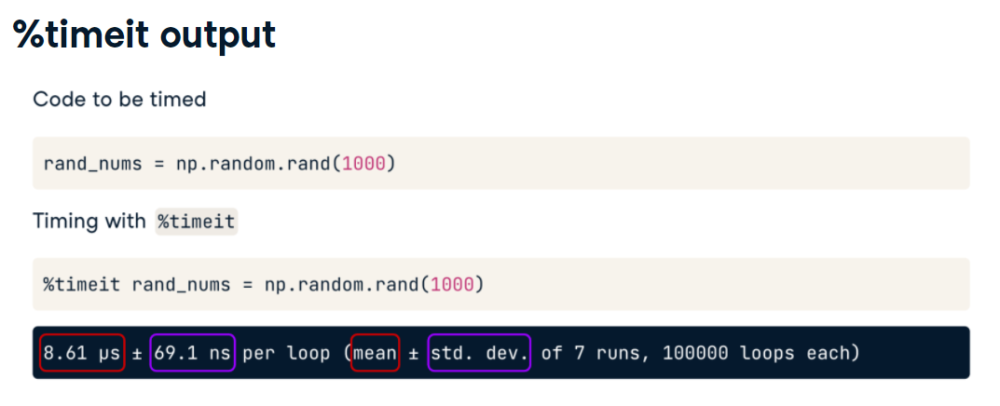
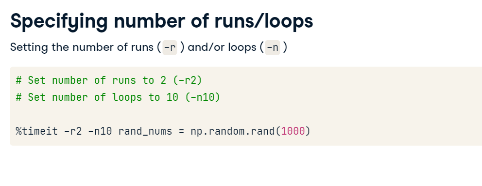
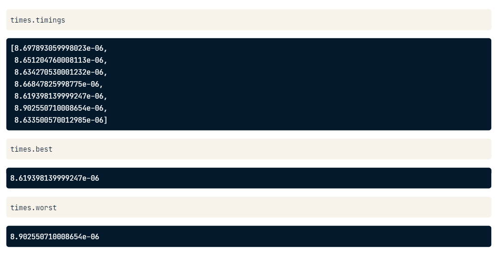
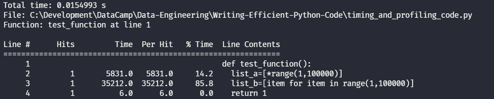
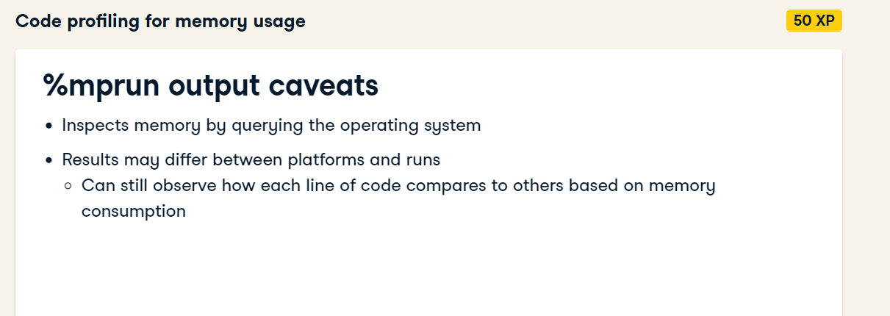

# Examining Runtime

Calculate runtime with IPython magic command `%timeit`

*Magic Commands* enhancements on top of normal Python Sintax, preffix by % sign

It onlys works within IPython sessions, by calling: `ipython` in your terminal.





We can run timeit in multiple line by using multiple %%

and also save the output with -o
like: times = %timeit -o list_a = [*range(1,100)]



Evaluating performance using dict() or {}

time_new_dict = %timeit -o new_dict = dict()
time_new_dict_literal = %timeit -o new_dict_literal = {}

## Code Profiling

`pip install line_profiler`

%load_ext line_profiler
%lprun -f test_function test_function()




### Profiling Memory Usage

One quick and dirty approach 
```
import sys
#it gives the size of individual object
num_list = [*range(1000)]
sys.getsizeof(num_list)
```

One better way is to use *memory_profiler* package
`pip install memory_profiler`

In order to use it (it comes with Magic Command from IPython):

```
%load_ext memory_profiler
%mprun -f test_function test_function()

```




