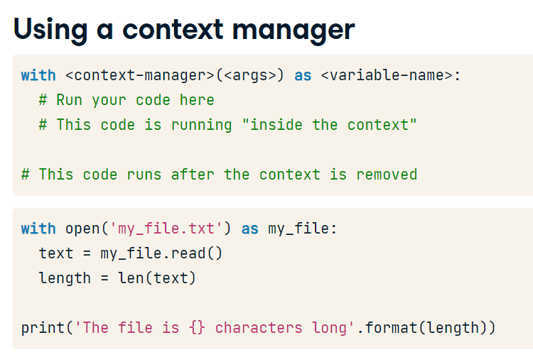
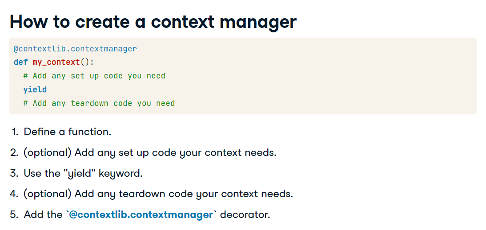
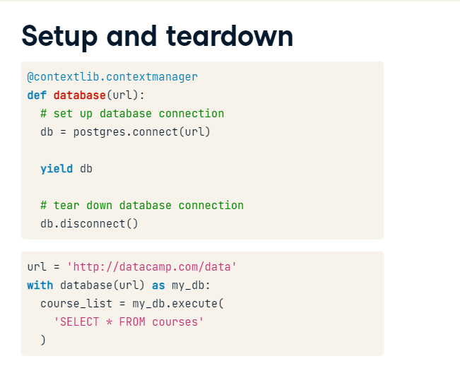
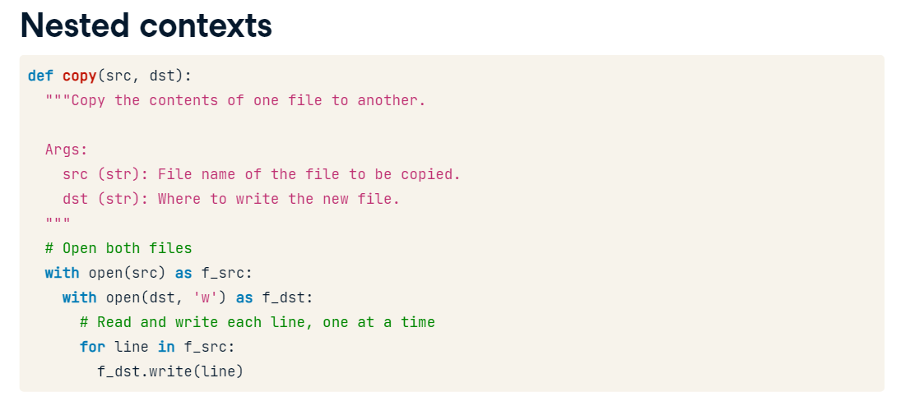
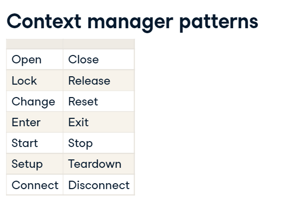

# Context Manager

The open function is a context manager

```
with open('file.txt') as my_file:
  text = my_file.read()
  length =len(text)
```



# Define a Context Manageer



**yield:** Means that it'll return a value, but expect to finish the function at some point in the future. the value yield returns can be add to your functions using as

```
import contextlib
@contextlib.contextmanager
... def my_context():
...     print('hello')
...     yield 42
...     print('goodbye')
...
>>> with my_context() as foo:
...     print(f"foo is {foo}")

```
very useful for database, to avoid forget to close.



Timer Context Manager

```
import time
# Add a decorator that will make timer() a context manager
@contextlib.contextmanager
def timer():
  """Time the execution of a context block.

  Yields:
    None
  """
  start = time.time()
  # Send control back to the context block
  yield
  end = time.time()
  print('Elapsed: {:.2f}s'.format(end - start))

with timer():
  print('This should take approximately 0.25 seconds')
  time.sleep(0.25)

```

Creating a Opening a file in a context manager
```
@contextlib.contextmanager
def open_read_only(filename):
  """Open a file in read-only mode.

  Args:
    filename (str): The location of the file to read

  Yields:
    file object
  """
  read_only_file = open(filename, mode='r')
  # Yield read_only_file so it can be assigned to my_file
  yield read_only_file
  # Close read_only_file
  read_only_file.close()

```

# Advanced Topics

If we want to copy content form one file to another, you can create two contexts to copy all data in memory and then save it to the destination, but if you have large files the memory would not be enough, so it's possible to nest context to write line by line


In order to ensure that the function will close or exit successfully even when an error occurs, it's needed to add the Try Finally block. Like:

```
@contextlib.contextmanager
def open_read_only(filename):
  """Open a file in read-only mode.

  Args:
    filename (str): The location of the file to read

  Yields:
    file object
  """
  try:
    read_only_file = open(filename, mode='r')
    # Yield read_only_file so it can be assigned to my_file
    yield read_only_file
    # Close read_only_file
  finally:
    read_only_file.close()

```
If your code follows any of these patterns, it's recommended to use context managers
