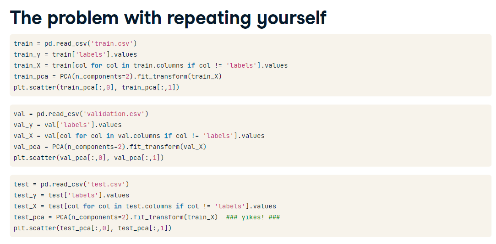
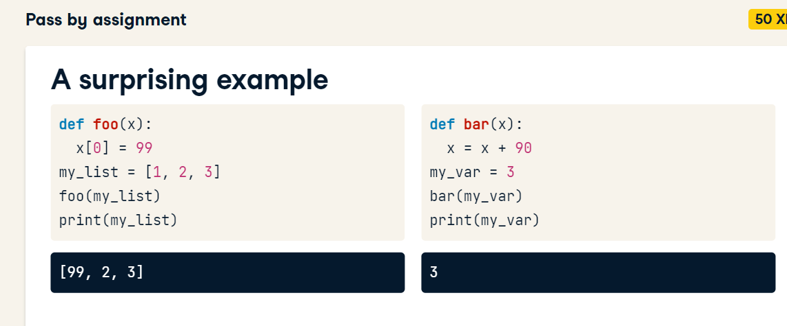
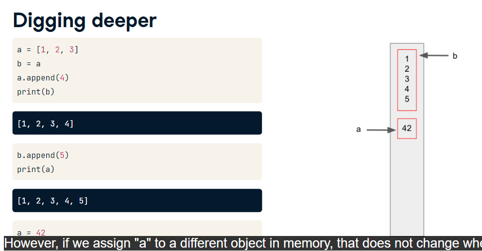
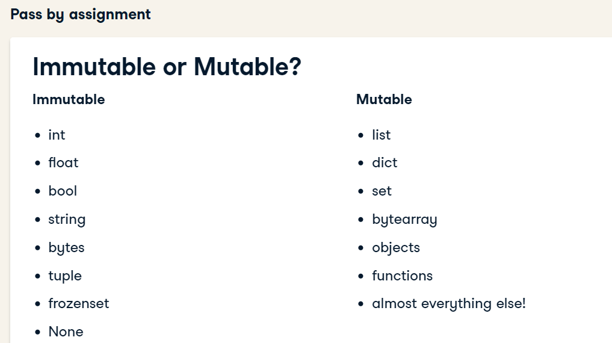

# Best Practice

Docstring contains: 
-Description of what the function does
-Description of arguments
-Description of return values, if any
-Description of errors raised
-Optional Examples'''''a','b''''

### Docstrings format
- Googledoc
- Numpydoc
-reStructured Text
-EpyText

Example Google doc

def myfunction():
"""description of a function

Args: 
  arg_1 (str): Description of arg1 that can break
  line if needed
  arg_2 (str, optional): Description of arg2 that can break
  line if needed

Returns:
  bool: Optional description of the return value Extra lines
  not idented

Raises: 
  ValueError: Includes any error that is intentionally
  
Notes: 
  See https:ccccc.com for more info
"""

Example numpydoc
"""
Description of function does

Parameters
----------
arg_1 : expected type of arg_1
  Description of arg_1
arg_2 : int, optional
  Write optional when argument has default value
  Default=42

Returns
-------
The type of the return value
  Can include description of return value 
  Replace returns with Yields

"""

### Retriving docstrings
print(myfunction.__doc__)

or you can use inspector

import inspector

inspector.getdoc(myfunction)

# Dry And Do one Thing

Also Do one thing, each function should have one responsibility like: just return a value, or just plot, etc...

More Flexible 
More easily understood
Simpler to test
Simpler to debug
Easier to change

## Pass by assignment

Lists are mutable and integers are immutable, so you can change lists passing them in a parameter to a function, but not integers

If you assign a = [1,2,3], it'll save [1,2,3] in a memory and point a to this position, if we include b = a, so b and a are pointing to the same place. if you change to the list a is pointing it'll change b

