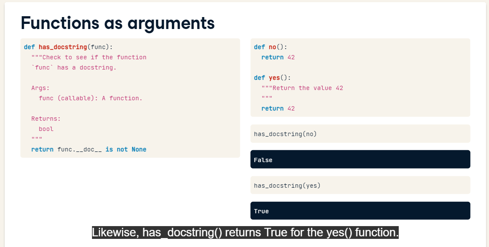
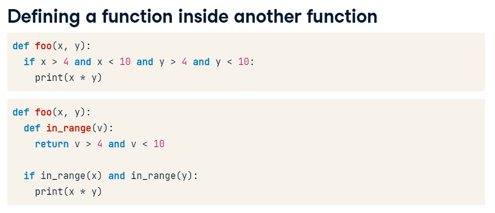
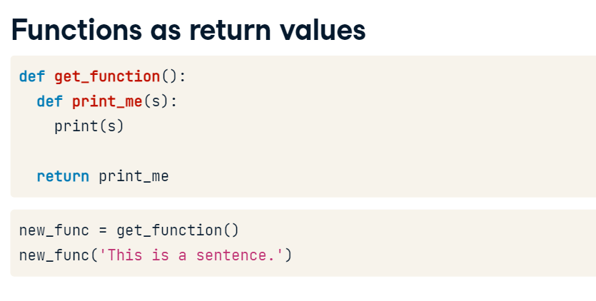
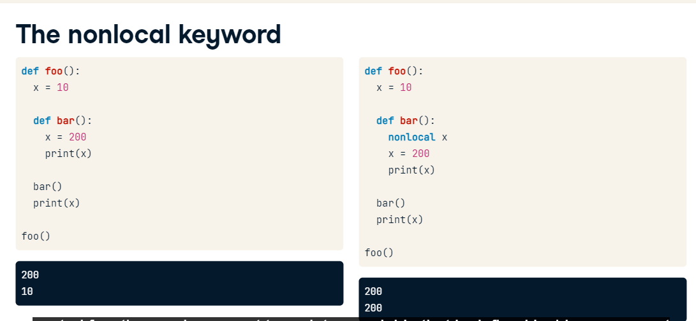
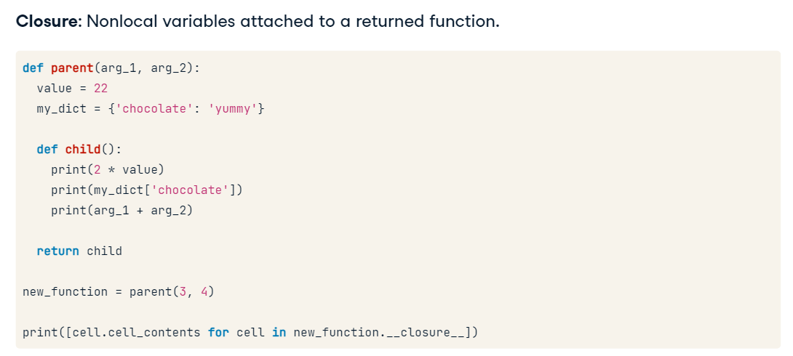
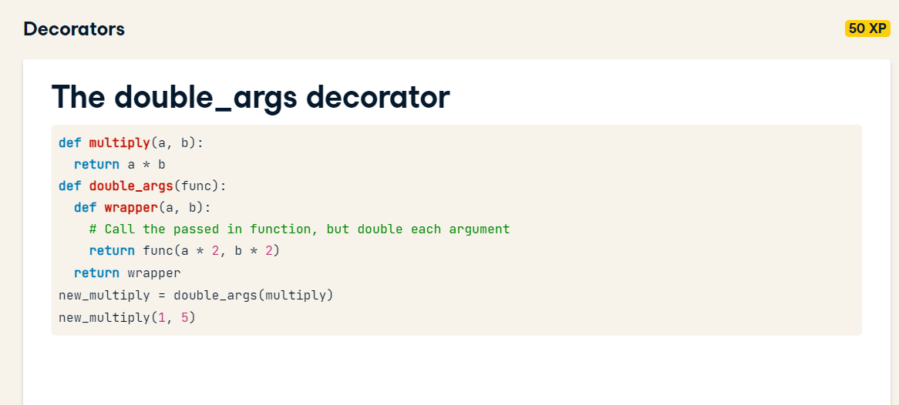
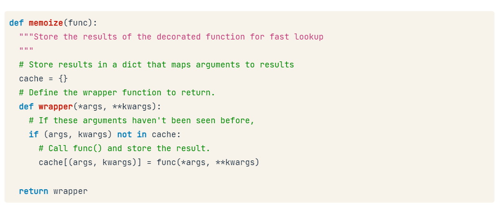
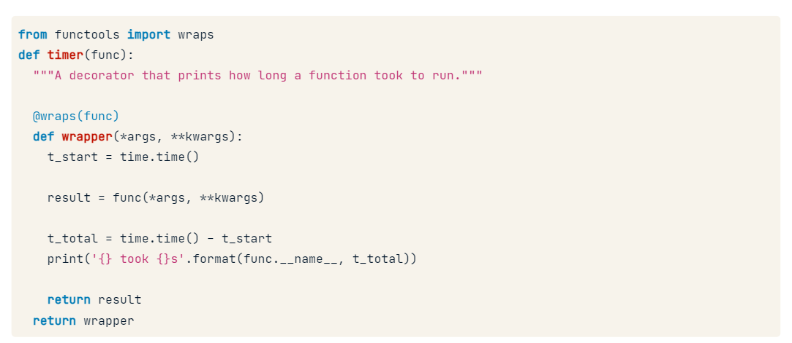
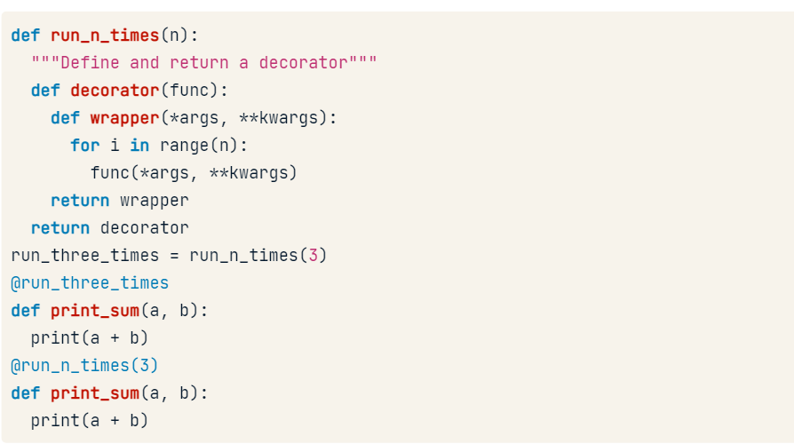

# Functions as objects







# Scope

The scope is in that order: builtin, global, nonlocal, local.

keywords: global and nonlocal



# Closures

A python way to attach nonlocal variables to a returned a returned function so that the function can operate even when it is called outside of its parent scope.


# Decorators

Uses all those concepts:

* Function as objects
* Nested function
* Nonlocal scope
* Closures



```
def print_before_and_after(func):
  def wrapper(*args):
    print('Before {}'.format(func.__name__))
    # Call the function being decorated with *args
    func(*args)
    print('After {}'.format(func.__name__))
  # Return the nested function
  return wrapper

@print_before_and_after
def multiply(a, b):
  print(a * b)

multiply(5, 10)
```

Real World Examples

Timer

```
import time

@timer 
def function:
```

Memoize is to cache function call results if it's called with the same argument



# Decorators and Metadata

If you have a decorator you'll loose your metadata from your original function, like: docstrins, name, default, etc...
To solve it, you can use `from functools import wraps` in your decorator implementation like:



In order to run the function unwrapped add the attribute `__wrapped__` like duplicated_list = duplicate.__wrapped__(list(range(50)))

## Decorators that takes Arguments


