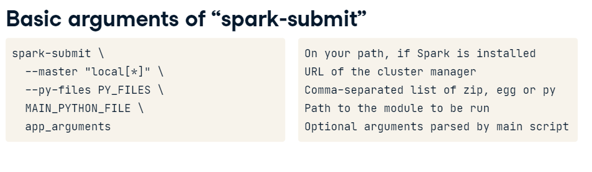
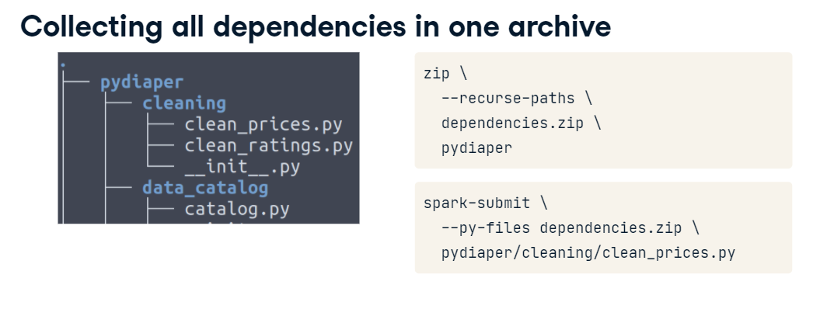
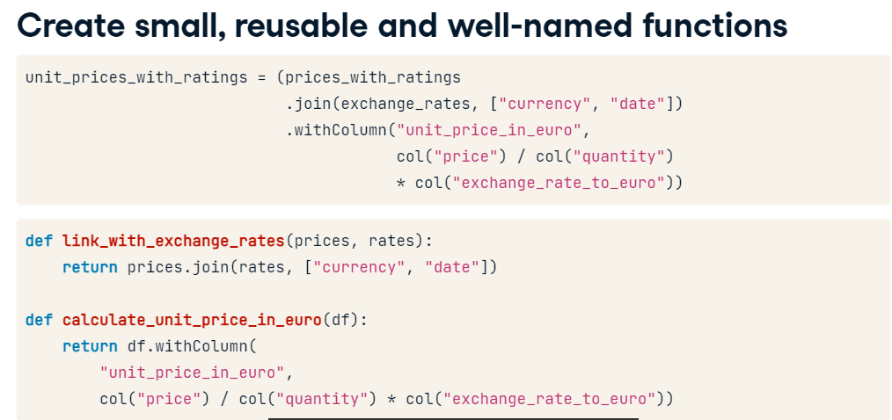
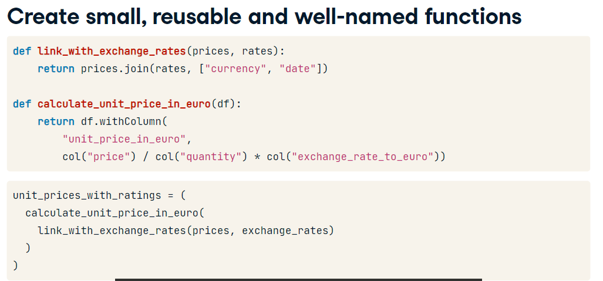
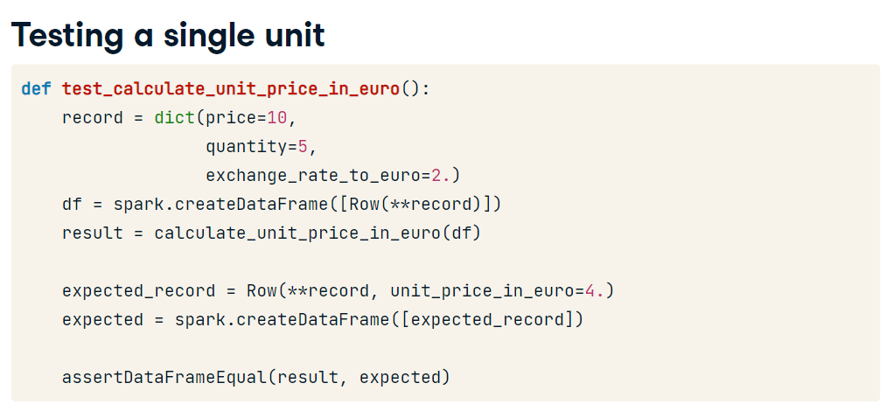

# Ingest Data

- Landing Zone: unaltered data 
- Clean Zone: Cleaned Data
- Business Zone: Special Rules

## Singer core concepts

Aim: "The open-source standard for writing scripts that move data"

Singer is a specification

- data exchange format JSON
- extract and load with taps and targets
  - language independent
- communicate over stream
  - schema (metadata)
  - state (process metadata)
  - record (data)

  Describing the data through schema

  columns = ("id", "name", "age", "has_children")
  users = {(1, "teste", 32, True),(2, "teste", 32, True),(3, "teste", 32, True)}
  json_schema={"properties": {"age": {
  "maximum": 130,
  "minimum": 1,
  "type": "integer"  },
  "has_children": {"type": "boolean"},
  "id": {"type": "integer"},
  "name": {"type": "string"}}
  "$id": "http://yourdomain.com/myschema.json",
  "$schema": "http://json-schema.org/draft-07/schema"  }

  ```
  import singer

  singer.write_schema(schema=json_schema,
                      stream_name='DC_employess',
                      key_properties=["id"])
 
  ```

  Output:

  ```
  {"type": "SCHEMA", "stream": "DC_employees", "schema": {"properties": {"age": {
  "maximum": 130,
  "minimum": 1,
  "type": "integer"  },
  "has_children": {"type": "boolean"},
  "id": {"type": "integer"},
  "name": {"type": "string"}}
  "$id": "http://yourdomain.com/myschema.json",
  "$schema": "http://json-schema.org/draft-07/schema"  }}
  ```
  JSON:

  ```
  import json

  json.dumps(json_schema["properties"]["age"]) # Convert to a JSON String
  with open('test.json', mode="w") as fh:
    json.dump(obj=json_schema, fp=fh) #Wrties to a file
  ```

  ## Streaming record messages

  ```
  columns= ("id","bla")
  users = {(1,1,1),(2,2,2)}
  singer.write_record(stream_name="DC_employess", record=dict(zip(columns, users.pop())))

  # or fixed dict

  fixed_dict = {"type": "RECORD", "stream": "DC_employess"}

  record_msg = {**fixed_dict, "record": dict(zip(columns, users.pop())) }

  **Using **dict_name you cna unpack its value in another dict. ** Pretty nice**

  ```

  ```
  python my_tap.py | target-csv
  python my_tap.py | target-csv --config userconfig.cfg
  my-package-tap | target-csv --config userconfig.cfg
  my-package-tap | target-postgresql --config userconfig.cfg
  ```

# Pyspark

- A fast general engine for large-scale data processing
- 4 libraries built on top of Spark Core
  - SparkSQL (Manipulate tabular data)
  - Spark Streaming (Manipulate Streaming data)
  - MLlib
  - GraphX


Spark is used for:
- Data Processing at scale
- Interactive Analytics (Data Sciencists notebooks)
- Machine Learning

Spark is not used for: (Overhead, Overkill)
- When you have only little data
- When you have only simple operations

## Starting a session with Pyspark

```
from pyspark.sql import SparkSession

spark = SparkSession.builder.getOrCreate()

## Reading a csv file
prices = spark.read.csv("/mnt/landing/prices.csv")
prices.show()
```

**Spark Automatic inferred data types**

```
from pprint import pprint
pprint(prices.dtypes)

```

**It's also possible to enforce schema**

```
schema= StructType([StructField("store", StringType(), nullable= False),
StructField("store", FloatType(), nullable= False),
StructField("ahaha", IntegerType(), nullable= False),
StructField("stoasdasdre", DateType(), nullable= False),
])

prices = spark.read.options(header="true").schema(schema).csv("mnt/ah/ashd/prices0.csv")
print(prices.dtypes)
```

## Cleaning data

Data types: ByteType (-128,127), ShortType (-32768,32678), IntegerType(-2147483648, +...), FloatType , StringType, BooleanType, DateType;

**In order to drop bad formatted rows**

```
prices = (spark.read.options(header="true", mode="DROPMALFORMED").csv('landing/prices.csv'))
```

**In order to FILLNA bad formatted rows**

```
prices = (spark.read.options(header="true").csv('landing/prices.csv'))
prices.fillna(25, subset=['quantity']).show()
```

**Using when function**

better_frame = employees.withColumn("end_date", when(col("end_date" > one_year_from_now, None).otherwise(col("end_date"))))

## Filtering

```
prices_in_belgium = prices.filter(col('countrycode') == 'BEL').orderBy(col('date'))
```

## Selecting

```
prices.select(col("store"), col("brand").alias("brandname")).distinct()

```

## Aggregating

```
(prices.groupBy(col('brand')).mean('price')).show
```

```
(prices.groupBy(col('brand')).agg(avg('price').alias('test'),count('brand').alias('haha')).show
```

## Joining

```
new_table = prices.join(states, on='id', 
how='inner')

new_table = prices.join(states, ['brand', 'model')
```

# SQL Window Partitioning

Partition by colum

`select colum1, colum1 over(partition by colum3)`

Partition by column in a order

`select colum1, colum1 over(partition by colum3 order by colum2 asc)`

Partition by beginning of the line till current row

`select colum1, avg(colum1) over(partition by colum 3 order by colum2 asc rows between unbounded preceding and current row) as avg_cumulative`

Partition by a slice in a time (like moving average)

`select column1, avg(column2) over(partition by day_colum ORDER BY day_column ASC ROWS BETWEEN 7 PRECEDING AND CURRENT ROW) AS media_movel_7_dias`

Partition by slice in a future time. It selects 5 rows before current time, 5 rows after current time and the current time row.

`select column1, column2 over(partition by day_column ORDER BY day_column DESC ROWS BETWEEN 5 PRECEDING AND 5 FOLLOWING`

get the first value of each partition

`select column1, first_value(colum2) over(partition by day_column ROWS BETWEEN unbounded preceding and unbounded following`

in order to get the first value in a windows without the first_value function you can use ROW_NUMBER() like:

`WITH test AS (select column1, ROW_NUMBER() over(partition by column_day ORDER BY column_day ASC) row_n) SELECT * FROM test WHERE row_n=1`

in order to rank you can use RANK or RANK_DENSE, the difference is RANK() will skip values if repeated but RANK_DENSE will not.

```
SELECT *, RANK() OVER (partition by column1 order by column2 desc )

SELECT *, DENSE_RANK() OVER (partition by column1 order by column2 desc )

```

Finally, there is on SQL `cartesian join/product` which is the basically product of two tables, every record in first table with every record second table

Without using CROSS JOIN
```
SELECT  ID, NAME, AMOUNT, DATE
   FROM CUSTOMERS, ORDERS;
```

or with Cross Join

```
SELECT table1.column1 , table1.column2, table2.column1...
FROM table1
CROSS JOIN table2;

```

# Creating a data transformation pipeline with PySpark





`spark-submit --py-files py_files.zip main_entrypoint-file.py`

# Importance of test in Spark

In order to test you need to create a dataframe with data in memory instead of reading from somewhere
Like:

```
from pyspark.sql import Row

purchase = Row("price","quantity", "product")
record = purchase(12.99, 1, "cake")

df = spark.createDataFrame((record))

```

Create Small, reusable and well-named functions






obs: **record is used to unpack the dictionary which basically get the dict values from the keys and used it as function's Row arguments.

### CI/CD

CircleCI: Have a .circleci/config.yml on your project folder.

Example:

```
jobs:
  test:
    docker:
      - image: circleci/python:3.9
    steps:
      - checkout
      - run: pip install -r requirements.txt
      - run: pytest .
```

# Manage and Orchestraing Workflow Management

Luigi, Azkaban and Airflow