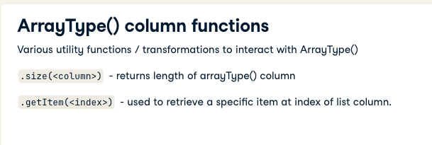
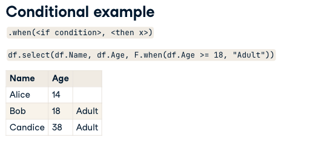
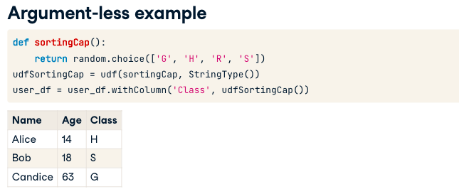
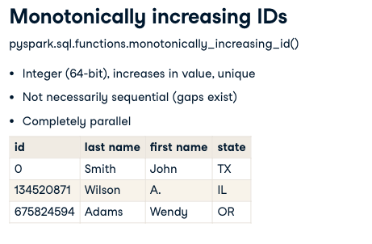
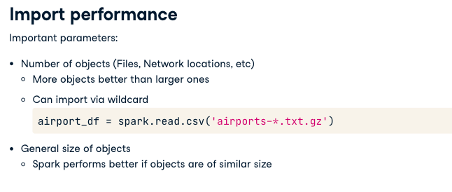

# Data Cleaning with Apache Spark

Problem with typical data systems

- Performance
- Organnizing data flow

Advantages of Spark

-Scalable: With python or perl or any language you can clean data but not billions of lines

Everything starts with **Schema**

- Define the format of a DataFrame
- May contain various data types
- Can filter garbage data during import 
- Improve read performance (normally a data import will try to infer a schema on read - this requires reading twice)

Example: (last field wheter the data can be NULL)

```
from pyspark.sql.types import *
peopleSchema = StructType([
    #Define the name field
    StructField('name', StringType(), True)
    # Add the age field
    StructField('age', IntegerType(), True)
    # Add the city field
    StructField('city', StringType(), True)
])

people_df = spark.read.format('csv').load(name='rawdata.csv', schema=peopleSchema)
```

## Immutability

Spark uses Immutable variables, that are a key component for functional programming, Defined once, unable to be directly modified, Re-created if reassigned, Able to be shared efficiently

```
voter_df = spark.read.csv('vote.csv')
voter_df = voter_df.withColumn('fullyear', voter_df.year + 2000)
voter_df = voter_df.drop(voter_df.year)
```

## Lazy Processing

Calculations are done just when using actions not Transformations.

## Understanding Parquet

Difficulties with csv

- No defined schema
- Nested data requires special handling
- Encoding Format Limited

Spark and CSV issues

- Slow to parse (Files cant be shared during import)
- All data must be read before schema can be infered
- Files cannot be filtered ( no "predicate pushdown")
- Any intermediate use requires redefining schema

Parquet (it`s a binary file)

- Columnar data format
- Supported in Spark and other data processing framewoek
- Supports predicate pushdown
- Automatically stores schema information

### Working with parquet

```
# Reading Parquet
df = spark.read.format('parquet').load('filename.parquet')

df = spark.read.parquet('filename.parquet')

# Writing parquet

df.write.format('parquet').save('filename.parquet')

df.write.parquet('filename.parquet')
```
### Parquet and SQL

```
flight_df = spark.read.parquet('file.parquet')
flight_df.createOrReplaceTempoView('flights')
short_flights_df = spark.sql('SELECT * FROM flights WHERE flightsduration<100')
```

## DataFrame Column Operations

DataFrames:

- Made up of rows & columns
- Immutable
- Use various transformations to modify data

```
voter_df.filter(voter_df.name.like('M%'))

voter_df.select('name', 'position')
```

Common Transformations:

- Filter / Where
    - remove nulls
    - remove odd entries
    - split data from combined sources
    - negative with `~`
    ```
    voter_df.filter(voter_df['name'].isNotNull())
    voter_df.filter(voter_df.date.year> 1800)
    voter_df.where(voter_df['_c0'].contains('VOTE'))
    voter_df.where(~ voter_df._c1.isNull())
    ```
- Select
- withColumn
- Drop

## Column string transformation

Most column string transformation are in the `pyspark.sql.functions`. e.g.

```
import pyspark.sql.functions as F
# 1
voter_df.withColumn('upper', F.upper('name'))
# 2
voter_df.withColumn('splits', F.split('name', ' '))
# 3
voter_df.withColumn('year', voter_df['_c4'].cast(IntegerType()))
```



```
# Show the distinct VOTER_NAME entries
voter_df.select('VOTER_NAME').distinct().show(40, truncate=False)

# Filter voter_df where the VOTER_NAME is 1-20 characters in length
voter_df = voter_df.filter('length(VOTER_NAME) > 0 and length(VOTER_NAME) < 20')

# Filter out voter_df where the VOTER_NAME contains an underscore
voter_df = voter_df.filter(~ F.col('VOTER_NAME').contains('_'))

# Show the distinct VOTER_NAME entries again
voter_df.select('VOTER_NAME').distinct().show(40, truncate=False)
```

Working with Arrays

```
# Add a new column called splits separated on whitespace
voter_df = voter_df.withColumn('splits', F.split(voter_df.VOTER_NAME, '\s+'))

# Create a new column called first_name based on the first item in splits
voter_df = voter_df.withColumn('first_name', voter_df.splits.getItem(0))

# Get the last entry of the splits list and create a column called last_name
voter_df = voter_df.withColumn('last_name', voter_df.splits.getItem(F.size('splits') - 1))

# Drop the splits column
voter_df = voter_df.drop('splits')

# Show the voter_df DataFrame
voter_df.show()
```

## Conditional DataFrames Column Operations

Conditional Clauses are:

- Inline version of if / then / else
- .when()
- .otherwise()



```
df.select(df.Name, df.Age, .when(df.Age >= 18, "Adult")
.when(df.Age < 18, "Minor")
.otherwise("nothing"))
```


Examples

```
# Add a column to voter_df for any voter with the title **Councilmember**
voter_df = voter_df.withColumn('random_val',
                               F.when(voter_df.TITLE == "Councilmember", F.rand()))

# Show some of the DataFrame rows, noting whether the when clause worked
voter_df.show()
```

## User Defined Function (UDF)

- Python Method
- Wrapped via the `pyspark.sql.functions.udf` method
- Stored as a variable
- Called like a normal Spark function

Example:

**Reverse a string UDF**

```
def reverseString(mystr):
    return mystr[::-1]
```

Wrap the function and store as variable

```
#create the udf
udfReverseString = udf(reverseString, StringType())
#use with spark
user_df = user_df.withColumn('ReverseName', udfReverseString(user_df.Name))
```



## Partitioning and lazy processing

- Dataframes are broken up into partitions
- Partition size can vary
- Each partition is handled independently
- Transformations are lazy
- Nothing is done until an action is performed: .count, .write, etc..
- Transformations can be re-ordered for best performance
- Sometimes causes unexpected behaviour



```
# Get number of partitions

voter_df.rdd.getNumPartitions()
```
```
# Select all the unique council voters
voter_df = df.select(df["VOTER NAME"]).distinct()

# Count the rows in voter_df
print("\nThere are %d rows in the voter_df DataFrame.\n" % voter_df.count())

# Add a ROW_ID
voter_df = voter_df.withColumn('ROW_ID', F.monotonically_increasing_id())

# Show the rows with 10 highest IDs in the set
voter_df.orderBy(voter_df.ROW_ID.desc()).show(10)
```

```
# Determine the highest ROW_ID and save it in previous_max_ID
previous_max_ID = voter_df_march.select('ROW_ID').rdd.max()[0]

# Add a ROW_ID column to voter_df_april starting at the desired value
voter_df_april = voter_df_april.withColumn('ROW_ID', previous_max_ID + F.monotonically_increasing_id())

# Show the ROW_ID from both DataFrames and compare
voter_df_march.select('ROW_ID').show()
voter_df_april.select('ROW_ID').show()
```

# Caching

Caching in Spark

- Store DataFrames in memory or on disk
- Imrpoves spped on later transformations / actions
- Reduces resources usage (network, cpu, etc)

Disadvantages:
- Very large data sets may not fit in memory
- Local disk based caching may not be a performance improvement, if the data do not fit in memory (if you have slow local disk I/O its better to avoid cache )
- Cached objects may not be available

**Caching Tips**

- Cache only if you need it
- Try caching DataFrames at various points and determine if your performance imrpoves
- Cache in memory and fast SSD / NVMe storage
- Cache to slow local disk if needed
- Use intermediate files
- Stop caching objects when finished

Implementing cache:

Call `.cache()` on the Dataframe before Action (cache it`s classified as transformation)

```
voter_df = spark.read.csv('voter_data.txt.gz')
voter_df.cache().count()
```

*More cache operations*: `.is_cached` to determine cache status and `.unpersist()` when finished with DataFrame

```
start_time = time.time()

# Add caching to the unique rows in departures_df
departures_df = departures_df.distinct().cache()

# Count the unique rows in departures_df, noting how long the operation takes
print("Counting %d rows took %f seconds" % (departures_df.count(), time.time() - start_time))

# Count the rows again, noting the variance in time of a cached DataFrame
start_time = time.time()
print("Counting %d rows again took %f seconds" % (departures_df.count(), time.time() - start_time))

```

```
# Determine if departures_df is in the cache
print("Is departures_df cached?: %s" % departures_df.is_cached)
print("Removing departures_df from cache")

# Remove departures_df from the cache
departures_df.unpersist()

# Check the cache status again
print("Is departures_df cached?: %s" % departures_df.is_cached)
```

## Performance

Spark Clusters are made of two types of processes

- Driver process (handles task assignments and sonsolidation of the data results ftom the workers)
- Worker processes (handles transf/actions) they perform the activity and report back to the driver



**It`s also good for performance to define the schema before importing.**

**How to split objects**: 
- Use OS utilities / scripts (split, cut, awk)
This command split large files into small ones
`split -l 10000 -d largefile chunk-`
- Use custom scripts (like python)
- Write out to Parquet
```
df_csv = spark.read.csv('file.csv')
df_csv.write.parquet('data.pqrquet')
df = spark.read.parquet('data.parquet')
```

## Cluster Configuration

It can be configured via terminal or web UI.

- `spark.conf.get(<configuration name>)`
- `spark.conf.set(<configuration name>)`

```
# Name of the Spark application instance
app_name = spark.conf.get('spark.app.name')

# Driver TCP port
driver_tcp_port = spark.conf.get('spark.driver.port')

# Number of join partitions
num_partitions = spark.conf.get('spark.sql.shuffle.partitions')

# Show the results
print("Name: %s" % app_name)
print("Driver TCP port: %s" % driver_tcp_port)
print("Number of partitions: %s" % num_partitions)

```

Spark Deployment Options: Single Node (all components in a single ssytem), Standalone (dedicated machines), Managed (Kubernetes, YARN or Mesos)

## Driver

- Task Assignment
- Result Consolidation and Monitoring
- Shared Data Access

Tips: 
    - Driver node should have double the memory of the worker.
    - Fast local storage helpful

Example:

```
# Store the number of partitions in variable
before = departures_df.rdd.getNumPartitions()

# Configure Spark to use 500 partitions
spark.conf.set('spark.sql.shuffle.partaitions', 500)

# Recreate the DataFrame using the departures data file
departures_df = spark.read.csv('departures.txt.gz').distinct()

# Print the number of partitions for each instance
print("Partition count before change: %d" % before)
print("Partition count after change: %d" % departures_df.rdd.getNumPartitions())
```

## Worker

- Runs actual tasks
- Ideally has all code, data and resources for a given task
Recommendations:
    - More worker nodes is often better than larger workers
    - Test to find the balance
    - Fast local storage extremely useful

## Performance Improvements

Explaining the Spark Execution Plan

```
voter_df = df.select(df['VOTER NAME']).distinct()
voter_df.explain()
```

**Shuffling**: Refers to moving data around to various workers to complete a task

- Hides complexity from the user
- Can be slow to complete
- Lowers overall throughput
- Is often necessary, but try to minimize its use.

**How to limit shuffling?**

- Limit use of .repartition(num_partitions) it requires a full shuffle of data between nodes & processes and is quite costly
    - Use `.coalesce(num_partitions` instead, it consolidates the data without requiring a full data shuffle. Note: Calling coalesce with a lerge number of partitions it does nothing
- Use care when calling `join()` it can often cause shuffle operations.
    - You can use `broadcast()` with `join()` to avoid it

**Broadcasting**
    - Provides a copy of an object to each worker
    - Prevents undue/excess communication between nodes
    - Can drastically spped up `join()` operations

    ```
    from pyspark.sql.functions import broadcast
    combined_df = df_1.join(broadcast(df_2))
    ```


## Data Pipeline with Spark

set of steps to process data from source to final output.

## Data Handling

- Incorrect Data
    - Empty Rows
    - Commented Lines
    - Headers
- Nested Structures
    - Multiple Delimiters
- NOn regular data
    - Differing numbers of columns per row
- Focused on CSV data

Sparker CSV Parser:
- Automatically removes blan lines
- Can remove comments using an optional argument
`df1 = spark.read.csv('datafile.csv.gz', comment='#')`

- Handles header field
    - Defined via arg
    - Ignored if a schema is defined
`df1 = spark.read.csv('datafile.csv.gz', header=True)`

Spark Will:

- Automatically create columns in A DataFrame based on sep arg:
`df1 = spark.read.csv('file.csv', sep=',')`

Example:

```
# Split _c0 on the tab character and store the list in a variable
tmp_fields = F.split(annotations_df['_c0'], '\t+')

# Create the colcount column on the DataFrame
annotations_df = annotations_df.withColumn('colcount', F.size(tmp_fields))

# Remove any rows containing fewer than 5 fields
annotations_df_filtered = annotations_df.filter(~ (F.size(tmp_fields) < 5))

# Count the number of rows
final_count = annotations_df_filtered.count()
print("Initial count: %d\nFinal count: %d" % (initial_count, final_count))
```

## Data Validation

- Verify that dataset complies with the expected format
- Number of rows / cols
- Data types
- Complex rules

**Validating via joins**: Compares data against known values, easy to find data in a given set, comparatively fast, e.g:

```
parsed_df = spark.read.parquet('parsed.parquet')
company_df = spark.read.parquet('companies.parquet')
verified_df = parsed_df.join(company_df, parsed_df.company == company_df.company)
# This automatically removes any rows with a company not in the valid_df
```

Complex Rules validation: Calculations, Verify agains external source and lilkely uses a UDF to modify and verify a DF