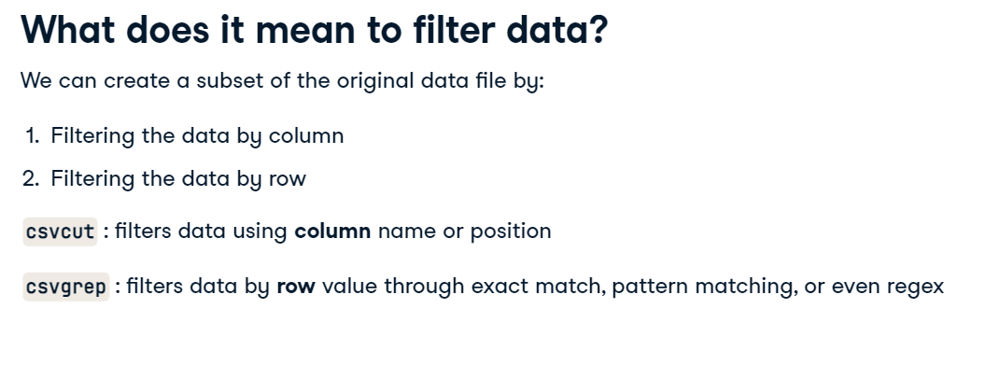

# CSVKIT

`pip install csvkit`

after installed, run in2csv --help

In order to convert xlsx files to csv

`in2csv test.xlsx > test.csv`

To show sheet names
`in2csv -n test.xlsx`

To convert just one sheet name

`in2csv test.xlsx --sheet "one_sheet" > test.csv`

**csvlook** is another command in csvkit that can print the csv in a markdown compatible format, like:

`csvlook test.csv`

**csvstat** is another command that acts like pandas describe, it give median, mean, quartile, etc...

`csvstat test.csv`

## Filtering

In order to get column names
`csvcut -n dataset.csv`

In order to get one colune
`csvcut -c 1 dataset.csv`
or
`csvcut -c "height" dataset.csv`

In order to get more than one column
`csvcut -c 1,2 dataset.csv`

**csvgrep** for filter row
can be used with -m (value to filter), -r (regex) or -f (path to a file)

`csvgrep -c 1,2 -m 10 dataset.csv`

**csvstack**: join csv files with the same schema, good for API restriction like pagination where you need to join all data after the job

`csvstack file.csv file2.csv > onefile.csv`

If you want to track the sources you can do like that:

`csvstack -g "source1","source2" -n "source" file.csv file2.csv > onefile.csv`

## Commands Operators

**;** links commands together and runs sequentially
**&&** links commands together, but only runs the 2nd command if the 1st succeeds.
**|** uses the output of the 1st commands as the input to the 2nd