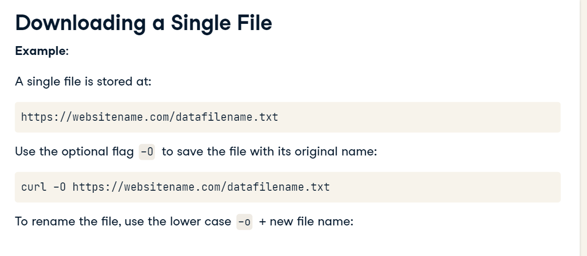
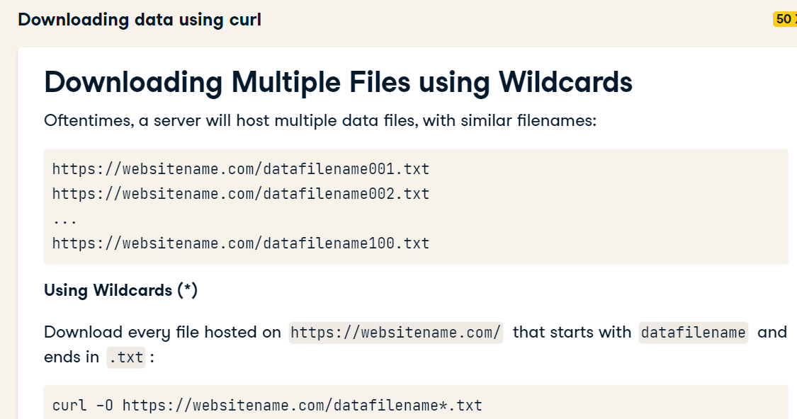
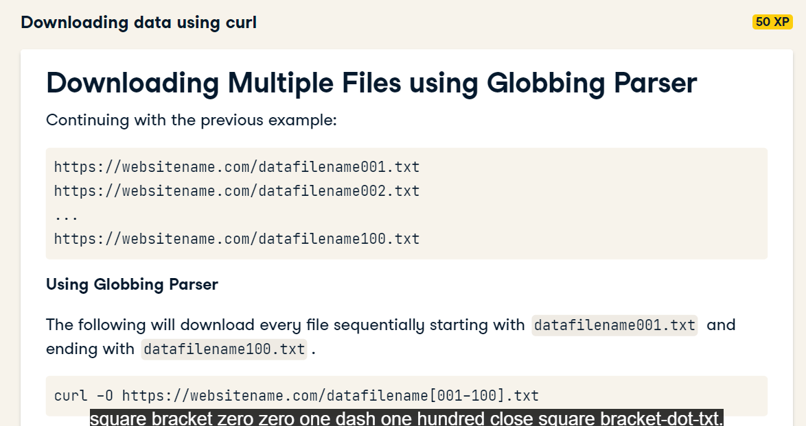
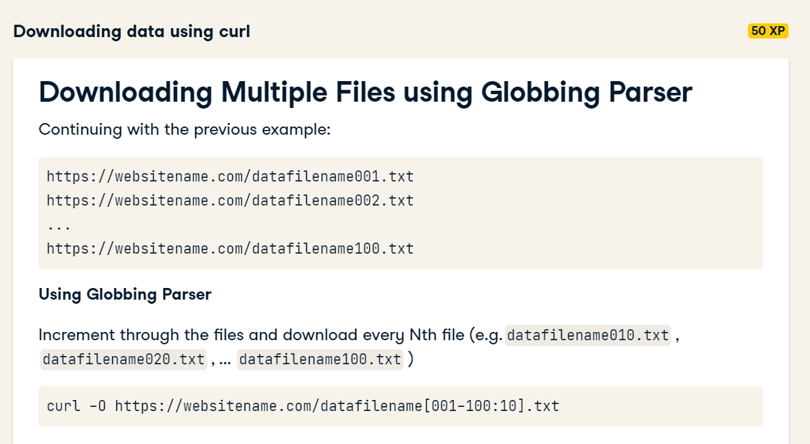
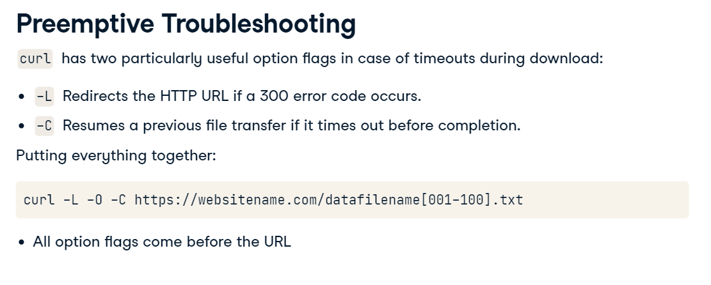
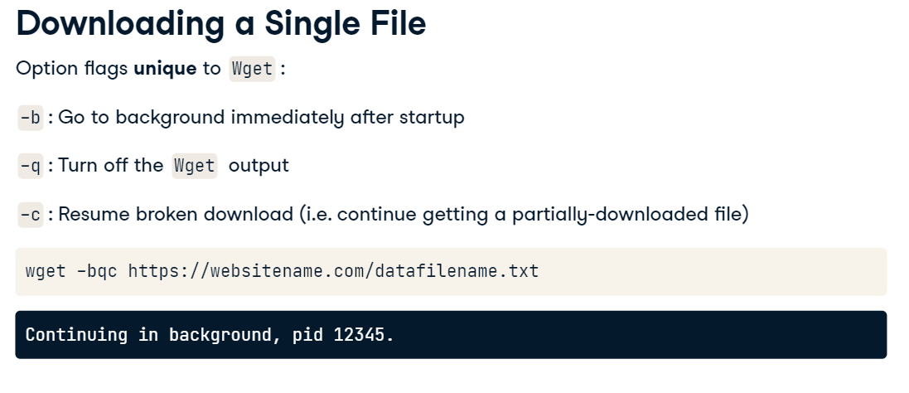

# Downloading data using curl

# WGET

Better than curl to recursively download.

Same structure to run the commands as curl.

you can create a list of urls and pass the follow command to download the files

`wget -i list.txt`

and also limit the bandwith using --limit-rate
like:

`wget --limit-rate=200k -i list.txt`

you can also give a pause between download each file in seconds
 `wget --wait=2.5 -i list.txt`