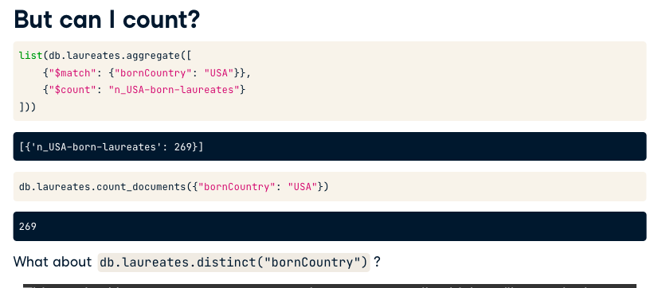
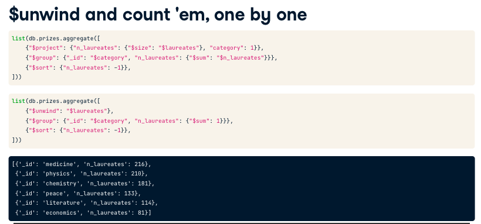

# MongoDB Flexibly Structured Data

MongoDB DocumentDB: JSON is the most used document with Mongodb.

JSON format: Objects {} or Arrays []


```
import requests
from pymongo import MongoClient

client = MongoClient()

```

Pymongo is the MongoDB official Driver.


```
# Save a list of names of the databases managed by client
db_names = client.list_database_names()
print(db_names)

# Save a list of names of the collections managed by the "nobel" database
nobel_coll_names = client.nobel.list_collection_names()
print(nobel_coll_names)
```

```
# Connect to the "nobel" database
db = client.nobel

# Retrieve sample prize and laureate documents
prize = db.prizes.find_one({})
laureate = db.laureates.find_one({})

# Print the sample prize and laureate documents
print(prize)
print(laureate)
print(type(laureate))
```

```
# Connect to the "nobel" database
db = client.nobel

# Retrieve sample prize and laureate documents
prize = db.prizes.find_one()
laureate = db.laureates.find_one()

# Print the sample prize and laureate documents
print(prize)
print(laureate)
print(type(laureate))

# Get the fields present in each type of document
prize_fields = list(prize.keys())
laureate_fields = list(laureate.keys())

print(prize_fields)
print(laureate_fields)
```

## Filter


It`s possible to use ``$`` Operator to have a dynamic filter. like:

**$in operator:** (there is an inverse $nin)
```
db.laureates.count_documents({
    'diedCountry': {
        '$in': ['France', 'Canada']}})
```

**$ne operator:**
```
db.laureates.count_documents({
    'diedCountry': {
        '$ne': 'France'}})
```

It`s also possible to nest operators like:

**$lte and $gt operator:** (Mongodb uses lexigraphic order, basically alphabetical order)
```
db.laureates.count_documents({
    'diedCountry': {
        '$gt': 'Belgium',
        '$lte': 'USA'}})
```

## Filtering using dots

Mongdb enables us to navigating through a document using dots, like:

```
filter = {
    'bornCountry.bornState.bornCity' : 'Guaratingueta'
}
```

## Schema

Although Mongodb allows us to enforce a schema it is not required, for example, fields does not need to have the same type across documents in a collection or even presence in the collection.

For instance, we can query for the existence of the field.

```
db.laureates.count_documents({"bornCountry": {"$exists": False}})
```

In order to check if there is an empty Array on some field: (acessing the first eleement in the list)

```
db.laureates.count_documents({"prized.0": {"$exists": True}})
```

## Distinct

Distinct aggregation is efficient is there is a collection index on the field

```
db.laureates.distinct('field')

# Countries recorded as countries of death but not as countries of birth
countries = set(db.laureates.distinct("diedCountry")) - set(db.laureates.distinct("bornCountry"))
print(countries)

```

We can use distinct also with another filter like:

```
criteria = {
    'category', {'laureates.share': '4'} 
}
db.laureates.distinct()
```

```
# Save a filter for prize documents with three or more laureates
criteria = {"laureates.2": {"$exists": True}}

# Save the set of distinct prize categories in documents satisfying the criteria
triple_play_categories = set(db.prizes.distinct('category', criteria))

# Confirm literature as the only category not satisfying the criteria.
assert set(db.prizes.distinct('category')) - triple_play_categories == {'literature'}
```

## Find

```
list_filter = list(db.laureates.find(filter))
```

## Element Match


## Regular Expressions

```
db.laureates.distinct({
    "bornCountry", {
        "bornCountry": {
            "$regex": "Poland"
        }
    }
})
```


Some tips:

Beginning of the string: "^Poland"
End of the string: "Poland\$"

## Projection

- Reduce data to fewer dimensions
- asking certain data to speak up


```
# Save documents, projecting out laureates share
prizes = db.prizes.find({}, ['laureates.share'])

# Iterate over prizes
for prize in prizes:
    # Initialize total share
    total_share = 0
    
    # Iterate over laureates for the prize
    for laureate in prize["laureates"]:
        # convert the laureate's share to float and add the reciprocal to total_share
        total_share += 1 / float(laureate["share"])
        
    # Print the total share    
    print(total_share)    

```

## Sorting

We can sort the data using python like below


Or direct on MongoDb (recommended) like below:


If it needed to sort based on 2 different columns, we need to pass a tuple, as Python 3.6- does not guarantee the order of the keys different from Javascript.


## Index

Think about MongoDB collection as a book, document as a page and each field as a type of content.

When to use indexes?

- Queries with high specifity
- Large documents
- Large collections

Rathen than load these into memory from disk, Mongo can use much-smaller indexes 


Creating compound index:

```

db.name_collection.create_index([("category", 1), ("type", -1)])
```

### Query Performance

`db.laureates.index_information()` Checks if there is an index for a specific collection

`db.laureates.find({}).explain()` returns Query Plan


## Limits and Skips params

You can use limit and skip to work like pagination on the cursor created by the find method.


## Aggregations

Aggregations work like stages processing the data





```
from collections import OrderedDict
from itertools import groupby
from operator import itemgetter

original_categories = set(db.prizes.distinct("category", {"year": "1901"}))

# Save an pipeline to collect original-category prizes
pipeline = [
    {"$match": {"category": {"$in": list(original_categories)}}},
    {"$project": {"category": 1, "year": 1}},
    {"$sort": OrderedDict([("year", -1)])}
]
cursor = db.prizes.aggregate(pipeline)
for key, group in groupby(cursor, key=itemgetter("year")):
    missing = original_categories - {doc["category"] for doc in group}
    if missing:
        print("{year}: {missing}".format(year=key, missing=", ".join(sorted(missing))))
```


```
from collections import OrderedDict

original_categories = sorted(set(db.prizes.distinct("category", {"year": "1901"})))
pipeline = [
    {"$match": {"category": {"$in": original_categories}}},
    {"$project": {"category": 1, "year": 1}},
    
    # Collect the set of category values for each prize year.
    {"$group": {"_id": "$year", "categories": {"$addToSet": "$category"}}},
    
    # Project categories *not* awarded (i.e., that are missing this year).
    {"$project": {"missing": {"$setDifference": [original_categories, "$categories"]}}},
    
    # Only include years with at least one missing category
    {"$match": {"missing.0": {"$exists": True}}},
    
    # Sort in reverse chronological order. Note that "_id" is a distinct year at this stage.
    {"$sort": OrderedDict([("_id", -1)])},
]
for doc in db.prizes.aggregate(pipeline):
    print("{year}: {missing}".format(year=doc["_id"],missing=", ".join(sorted(doc["missing"]))))
```

## Zoom into Array Fields




## Lookups


```
key_ac = "prizes.affiliations.country"
key_bc = "bornCountry"
pipeline = [
    {"$project": {key_bc: 1, key_ac: 1}},

    # Ensure a single prize affiliation country per pipeline document
    {"$unwind": "$prizes"},
    {"$unwind": "$prizes.affiliations"},

    # Ensure values in the list of distinct values (so not empty)
    {"$match": {key_ac: {"$in": db.laureates.distinct(key_ac)}}},
    {"$project": {"affilCountrySameAsBorn": {
        "$gte": [{"$indexOfBytes": ["$"+key_ac, "$"+key_bc]}, 0]}}},

    # Count by "$affilCountrySameAsBorn" value (True or False)
    {"$group": {"_id": "$affilCountrySameAsBorn",
                "count": {"$sum": 1}}},
]
for doc in db.laureates.aggregate(pipeline): print(doc)
```

## Cond and split and Bucket


```
pipeline = [
    {"$match": {"gender": {"$ne": "org"}}},
    {"$project": {"bornCountry": 1, "prizes.affiliations.country": 1}},
    {"$unwind": "$prizes"},
    {"$addFields": {"bornCountryInAffiliations": {"$in": ["$bornCountry", "$prizes.affiliations.country"]}}},
    {"$match": {"bornCountryInAffiliations": False}},
    {"$count": "awardedElsewhere"},
]

# Construct the additional filter stage
added_stage = {"$match": {"prizes.affiliations.country": {"$in": db.laureates.distinct("prizes.affiliations.country")}}}

# Insert this stage into the pipeline
pipeline.insert(3, added_stage)
print(list(db.laureates.aggregate(pipeline)))
```