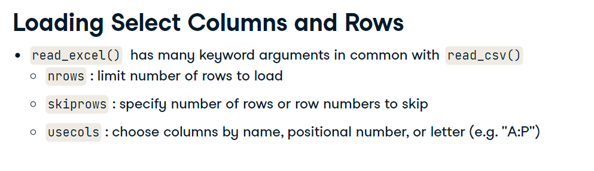
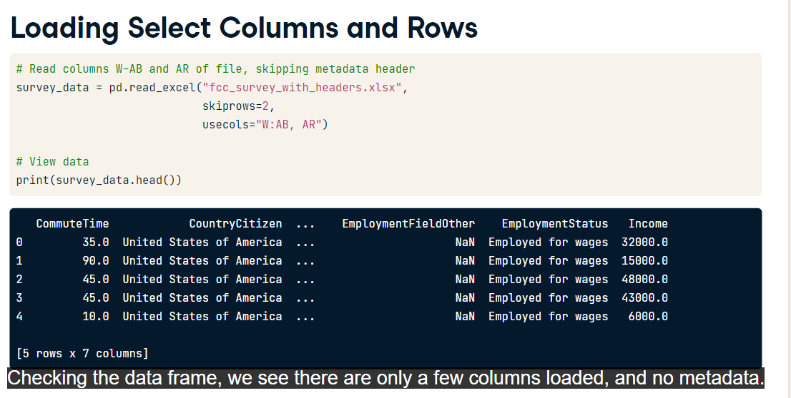
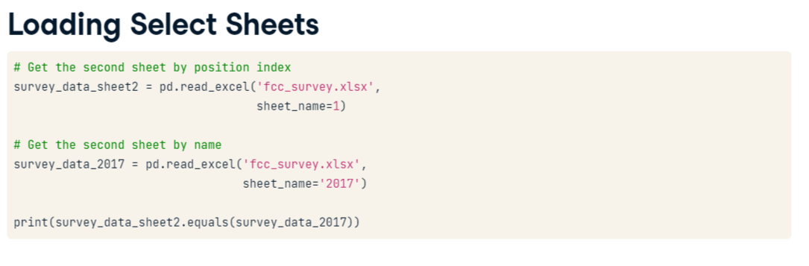
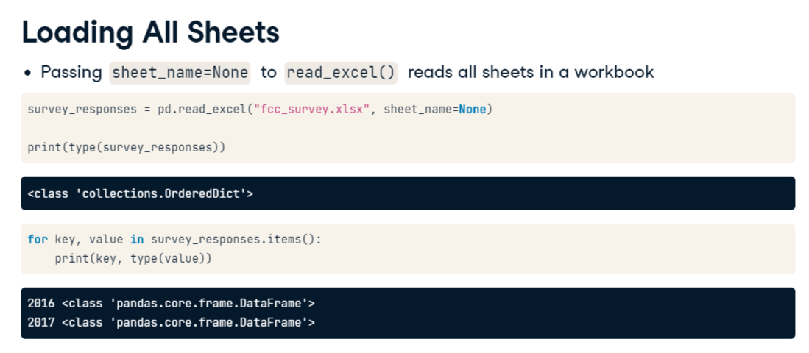
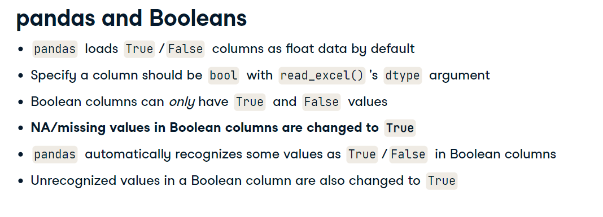
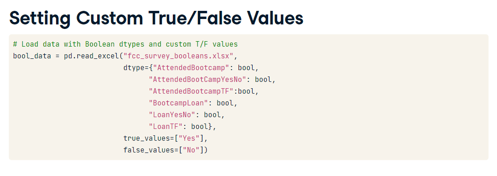
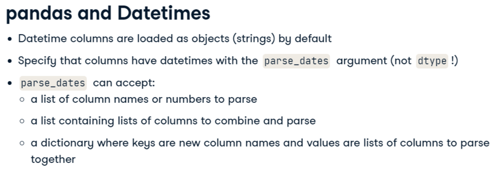
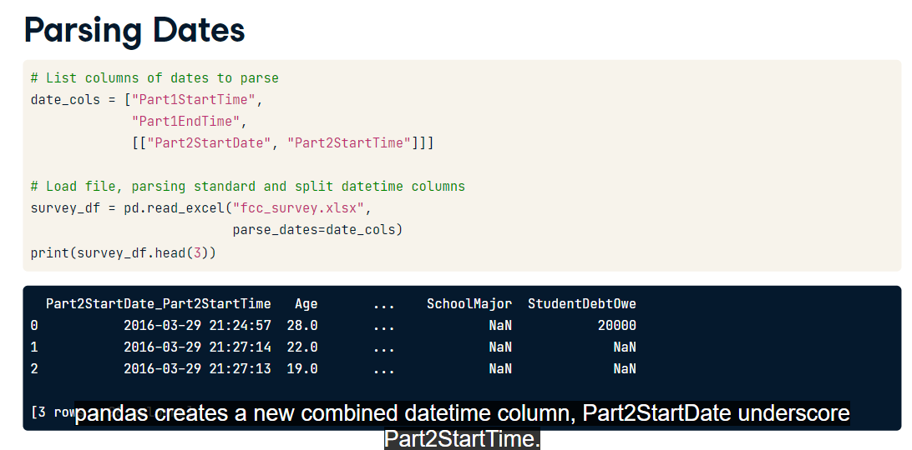
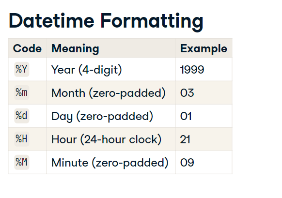

# Notes

## Loading Spreadsheets

```
import pandas as pd
data = pd.read_excel('excel.xlsx')
```





**This will create a colletction with a dataframe be sheet**



**Careful when converting to Boolean Type**



**Very good way to convert Boolean Values with read_excel in pandas specyfing `true_values` and `false_values` params**



## Parsing Datatime



**Each Element in the `parse_dates` list param is a column, you can pass a list of list to specify column date separated from time, you can also create a dictionary instead, to control the columns names like: {'date1': 'date1_ts', 'date2': ['date2_ts','time2_ts' ] }**



**If you have non-standard date format, parse_dates may not work, so you can use `pd.to_datetime()` instead and use the `format` param**

