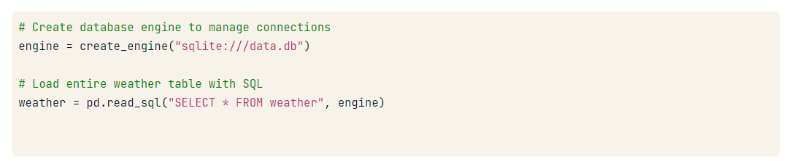

# Notes

## We'll be using SQLalchemy and SQLLite

to read data using pandas.

`pd.read_sql(query, engine)`

query: contains sql query to run table to load
engine: Connection/database engine object

Using sqlalchemy and pandas to get data from SQLIte and passing to read_sql the table name

Or you can pass sql query instead of table name
