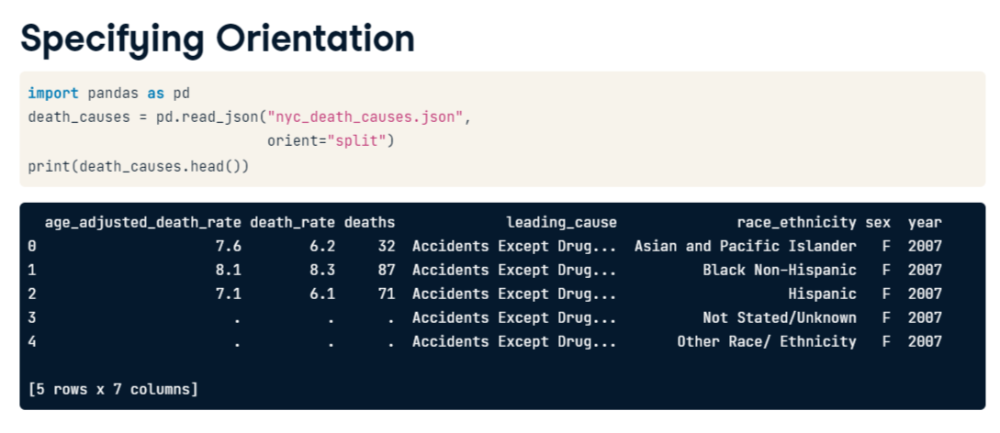
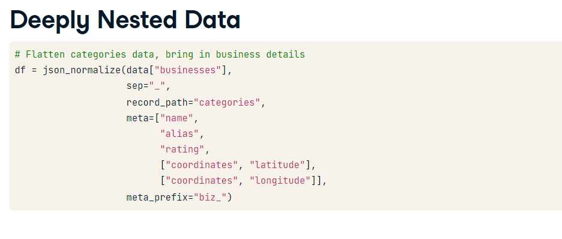
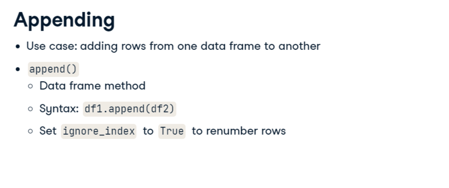

# Notes

## Working with JSON



Opening JSON without keywords (try and catch to treat error)
```
try:
    # Load the JSON without keyword arguments
    df = pd.read_json('dhs_report_reformatted.json')
    
    # Plot total population in shelters over time
    df["date_of_census"] = pd.to_datetime(df["date_of_census"])
    df.plot(x="date_of_census", 
            y="total_individuals_in_shelter")
    plt.show()
    
except ValueError:
    print("pandas could not parse the JSON.")

```

## Working with simple nested JSON

```

# Load json_normalize()
from pandas.io.json import json_normalize

# Isolate the JSON data from the API response
data = response.json()

# Flatten business data into a data frame, replace separator
cafes = json_normalize(data["businesses"],
             sep='_')

# View data
print(cafes.head())

```

## Working with nested JSONs



## Combining multiple datasets



